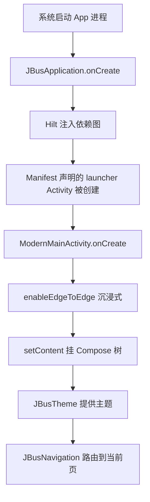

# 第 3 章：单 Activity 架构

> 📖 本章你将学到：为什么全局只有一个 Activity、它是怎么启动的、UI 切换靠什么。
> 🔗 前置章节：[第 1 章 项目总览](01-project-overview.md)（了解启动流程）
> 📁 项目对应目录：`ui/ModernMainActivity.kt`、`ui/Navigation.kt`、`JBusApplication.kt`

---

## 3.1 为什么需要单 Activity 架构

第 1 章已经埋过一个伏笔："老写法里一个页面 = 一个 Activity"。本章就把这个老写法拆掉。

想象你用 2014 年的方式做一个有 10 个页面的 App：列表页、详情页、搜索页、设置页、收藏页……很自然地你会建 10 个 Activity，每个都老老实实在 `AndroidManifest.xml` 里注册一遍。一开始没什么，但等业务真的跑起来，四大痛点会一个个冒出来。

### 痛点 1：状态跨 Activity 难共享

Activity 之间是相互独立的进程级组件——每个 Activity 有自己的字段、自己的 `onCreate`、自己的 `ViewModel`（如果你有的话）。你想把"当前登录用户"从列表页传到详情页，老办法只有两条路：

1. 把数据塞进 `Intent` 的 `extras` 里——只能传基本类型和 `Serializable`/`Parcelable`，复杂对象要手写 `Parcelable` boilerplate（俗称"万物皆 Parcelable"）。
2. 把数据存进一个 `object` 单例——又回到第 4 章会讲的"单例难测试、生命周期失控"老坑。

10 个 Activity 之间互相传对象、互相读单例，等你的 App 长到 20 个页面，"现在哪份数据是新鲜的"已经没人能说清。

### 痛点 2：每个 Activity 都要重复一遍模板

每个 Activity 都得写一遍这套模板：

```kotlin
class ListActivity : AppCompatActivity() {
  override fun onCreate(savedInstanceState: Bundle?) {
    super.onCreate(savedInstanceState)
    setContentView(R.layout.activity_list)         // 每个页面都得写
    setSupportActionBar(findViewById(R.id.toolbar)) // 每个页面都得写
    // 初始化 ViewModel、注册 Observer、设置返回按钮……每个页面都得写
  }
}
```

10 个页面就是 10 套几乎一样的 `onCreate`。主题设置、沉浸式、返回栈处理、动画配置——全要复制粘贴。改一处要改 10 处。

### 痛点 3：转场动画受限

`startActivity(Intent(this, DetailActivity::class.java))` 触发的是**系统级的 Activity 切换动画**——默认那个生硬的"从右往左滑"。想做个像 iOS 那样带 scale 的、或者 Material 的共享元素动画？需要 `overridePendingTransition`、`ActivityOptions.makeSceneTransitionAnimation` 一通操作，每个页面单独配置，难统一。

### 痛点 4：返回栈混乱

按 back 键时，系统按 Activity 栈的入栈顺序出栈。但用户的心智模型可能是"从详情页返回应该回到列表的同一位置"，而 Activity 栈的实际状态取决于 `launchMode`、`FLAG_ACTIVITY_*`、`taskAffinity` 等十几个 flag 的组合。新人最容易在这一片 flag 里迷路：明明只想"返回上一页"，结果按 back 退出 App 了。

> 单 Activity 架构（Single-Activity Architecture）就是为了解决这四个痛点——让**一个 Activity 当容器**，所有 UI 切换在容器内完成，状态、动画、返回栈全部由一个统一的"导航（Navigation）"机制管理。

---

## 3.2 单 Activity 架构是什么

### 3.2.1 核心思想：一个 Activity 当容器，UI 切换靠导航

单 Activity 架构的核心只有一句话：

> 整个 App 只有**一个 Activity** 承载 UI；所有"页面"都不是 Activity，而是这个 Activity 内部的**可替换的 UI 片段**。Activity 只负责"托管"，不负责业务。

谁来负责"切换片段"？两代方案：

- **老路线（Fragment 时代）**：一个 Activity + 多个 Fragment，由 Jetpack Navigation（Fragment 版本）在 Activity 内部切换 Fragment。Fragment 比 Activity 轻，生命周期更灵活。
- **新路线（Compose 时代）**：一个 Activity + 一棵 Compose 树，由 Compose Navigation（或更新的 Navigation 3）改"当前显示哪个 `@Composable` 函数"。没有 Fragment，连"片段"这个概念都省了。

### 3.2.2 Compose 时代的单 Activity：一棵树 + 导航

**本项目走的是 Compose 路线**。Activity 里只做一件事：

```kotlin
setContent {
  // 挂一棵 Compose 树，剩下的全部交给 Compose
  MyAppTheme {
    AppNavigation()        // ← 导航决定当前显示哪个 @Composable
  }
}
```

`setContent { ... }` 之后，这个 Activity 就退居幕后——它的角色变成"一个画布提供者"。所有"页面"（列表、详情、搜索、设置……）都是这棵 Compose 树上的 `@Composable` 函数，"切换页面"本质上是**改变当前显示哪个 Composable**。

### 3.2.3 优势速览

回过头看 §3.1 的四个痛点，单 Activity + Compose Navigation 是怎么解决的：

| 老痛点 | 单 Activity 怎么解 |
|--------|-------------------|
| 状态跨 Activity 难共享 | 全局只有一个 Activity，状态天然在它内部的 Compose 树里共享；ViewModel 也可以挂在导航的 backStack entry 上 |
| 每页重复 onCreate 模板 | Activity 只有一个，模板只写一次；每个"页面"只是 Composable 函数 |
| 转场动画受限 | 导航库统一管理转场（项目用了 iOS 风格的 slide + scale），一处定义处处生效 |
| 返回栈混乱 | 框架维护一个 `backStack`（一个 List），按 push/pop 顺序出栈，行为可预测 |

> 一句话对比：多 Activity 是"10 个独立房间互相串门"，单 Activity + Compose 是"一个大房间内换不同布景"。

---

## 3.3 最小示例：多 Activity vs 单 Activity + Compose

下面两个例子做的是同一件事：列表页 → 点一个条目 → 跳到详情页。注意"新增一个页面"在两种写法里要做的事完全不同。

### ❌ 老写法：多 Activity

```kotlin
// ListActivity.kt
class ListActivity : AppCompatActivity() {
  override fun onCreate(savedInstanceState: Bundle?) {
    super.onCreate(savedInstanceState)
    setContentView(R.layout.activity_list)
    findViewById<Button>(R.id.go_detail).setOnClickListener {
      val intent = Intent(this, DetailActivity::class.java)   // ← 显式 Intent
      intent.putExtra("id", 42)                                // ← 参数靠 extras
      startActivity(intent)                                    // ← 系统级切换
    }
  }
}

// DetailActivity.kt —— 还要在 Manifest 注册！
class DetailActivity : AppCompatActivity() {
  override fun onCreate(savedInstanceState: Bundle?) {
    super.onCreate(savedInstanceState)
    setContentView(R.layout.activity_detail)
    val id = intent.getIntExtra("id", -1)                      // ← 取参数
    // ...
  }
}
```

每加一个页面要：写一个 Activity 子类 + 写一个 XML 布局 + 在 Manifest 里 `<activity android:name="..."/>` 声明 + 用 Intent 串起来。参数靠 `putExtra` / `getIntExtra`，类型不安全（写错 key 就拿默认值，不报错）。

### ✅ 新写法：单 Activity + Compose Navigation

```kotlin
// 全局唯一的 Activity
class MainActivity : ComponentActivity() {
  override fun onCreate(savedInstanceState: Bundle?) {
    super.onCreate(savedInstanceState)
    setContent { AppTheme { AppNav() } }    // ← 只挂一棵树
  }
}

// 路由标识（类型安全）
@Serializable data object RouteList
@Serializable data class RouteDetail(val id: Int)

// 导航：定义两个 Composable 入口
@Composable
fun AppNav() {
  val backStack = rememberNavBackStack(RouteList)
  NavDisplay(
    backStack = backStack,
    onBack = { backStack.removeLastOrNull() },
    entryProvider = entryProvider {
      entry<RouteList> {
        ListScreen(onClick = { id ->
          backStack.push(RouteDetail(id))              // ← push 一个路由，类型安全
        })
      }
      entry<RouteDetail> { key ->                       // ← key 就是上面 push 的 RouteDetail
        DetailScreen(id = key.id)
      }
    }
  )
}
```

对比维度一目了然：

| 维度 | 多 Activity | 单 Activity + Compose |
|------|-------------|----------------------|
| 新增页面 | 写 Activity + XML + Manifest 声明 | 写一个 `@Composable` + 一个 `NavKey` |
| 参数传递 | `Intent.putExtra("id", 42)` 字符串 key，类型不安全 | `RouteDetail(id = 42)` 构造函数，类型安全 |
| 转场动画 | `overridePendingTransition(...)` 每页配 | 导航库统一配，一处定义 |
| Manifest 改动 | 每页都要加 `<activity>` | 全程只一个 `<activity>` |
| 状态共享 | Intent extras 或单例 | 同一棵 Compose 树内自然共享 |

> 关键认知切换：**新增页面 = 新增 Composable + 路由**，**不是**新增 Activity。新人最容易卡在这一步——习惯性地去找 `XxxActivity.kt`，结果什么也找不到。详见第 11 章。

### 最小 Activity 骨架

如果你要在一个新项目里复制本项目的写法，Activity 的最小骨架是这样：

```kotlin
@AndroidEntryPoint                                       // ① 让 Hilt 能注入（第 4 章）
class MainActivity : ComponentActivity() {

  override fun onCreate(savedInstanceState: Bundle?) {
    super.onCreate(savedInstanceState)
    enableEdgeToEdge()                                   // ② 沉浸式：内容延伸到状态栏下
    setContent {
      AppTheme {                                         // ③ Material3 主题（第 9 章）
        AppNavigation()                                  // ④ Compose 路由入口（第 11 章）
      }
    }
  }
}
```

四件事：**Hilt 入口**、**沉浸式**、**主题**、**导航入口**。除此之外 Activity 不该有任何业务逻辑——这是判断"单 Activity 架构写得对不对"的最简单标准。

---

## 3.4 项目中怎么用：三件套

本节是全章重点。本项目的"单 Activity 三件套"是：

1. `JBusApplication.kt` —— App 入口，Hilt 在这里启动；
2. `ModernMainActivity.kt` —— 唯一的 Activity；
3. `Navigation.kt` —— Compose 导航入口，决定显示哪个页面。

外加 `AndroidManifest.xml` 里只有一个 `<activity>` 声明作为旁证。

### 3.4.1 项目里的唯一 Activity

📁 项目对应位置：`app/src/main/java/me/jbusdriver/modern/ui/ModernMainActivity.kt:22`

```kotlin
@AndroidEntryPoint                                  // ① 让 Hilt 能注入这个 Activity
class ModernMainActivity : ComponentActivity() {

  @Inject lateinit var browserSessionClient: BrowserSessionClient   // 注入示例：浏览器会话
  @Inject lateinit var localVideoScanner: LocalVideoForegroundScanner

  override fun onCreate(savedInstanceState: Bundle?) {
    super.onCreate(savedInstanceState)
    enableEdgeToEdge()                              // ② 沉浸式（边缘到边缘）
    window.setSoftInputMode(SOFT_INPUT_ADJUST_NOTHING)
    handleIntent(intent)                            // 处理外部 deep link（URL 打开 App）

    setContent {
      JBusTheme {                                   // ③ Material3 主题（第 9 章）
        JBusNavigation(                             // ④ Compose 路由入口（第 11 章）
          deepLinkFlow = deepLink,
          onDeepLinkConsumed = { _deepLink.value = null }
        )
      }
    }
    // 启动后顺带 warm-up 浏览器会话（非 UI 职责，但放在 Activity 里只为拿 lifecycleScope）
    lifecycleScope.launch { runCatching { browserSessionClient.warmUp() } }
  }
}
```

关键观察：**Activity 全部职责就是"创建主题 + 挂 Compose 树 + 把 deep link 喂给导航"**。业务逻辑为零——没有 `findViewById`、没有 `setContentView(R.layout.xxx)`、没有 `recyclerView.adapter = ...`。所有"页面"（影片列表、详情、搜索、收藏……）都是这棵 Compose 树上的某个 `@Composable`，由 `JBusNavigation` 决定当前显示哪个。

> 注：上面省略了 deep link 解析和 `onNewIntent`/`onDestroy` 等技术细节，目的是突出主干。完整实现见原文件。

### 3.4.2 启动流程：从系统启动到看见首页

从用户点桌面图标到看见首页，调用链是这样走的：



每一步发生了什么：

1. **`JBusApplication.onCreate`** 是整个 App 的入口。`@HiltAndroidApp` 注解让 Hilt 在这一刻完成依赖图构造——所有 `@Module`、`@Inject` 在此时被串联起来。Application 还会通过 `newImageLoader()` 提供 Coil 图片加载器（防盗链 Referer 在这里配置）。
2. **Hilt 注入依赖图**：所有 `@Inject lateinit var` 字段（如 Activity 里的 `browserSessionClient`）此时被填上真实实例。详见第 4 章。
3. **`ModernMainActivity.onCreate`**：Manifest 里 `<intent-filter>` 含 `MAIN` + `LAUNCHER` 的那个 `<activity>` 在 App 启动时被系统自动创建。
4. **`enableEdgeToEdge()`**：让内容延伸到状态栏和导航栏下面，实现沉浸式体验。Compose 配合 `WindowInsets` API 处理避让。
5. **`setContent { JBusTheme { JBusNavigation(...) } }`**：把 Compose 树挂到这个 Activity 上。从此以后 UI 的世界就是 Compose 的，Activity 退居幕后。
6. **`JBusNavigation`** 根据 `backStack` 当前栈顶决定渲染哪个 Screen（`RouteMain` → `MainScreen`，`RouteMovieDetail(...)` → `MovieDetailScreen`，等等）。

> 📁 项目对应位置：`JBusApplication.kt:24` 是 `@HiltAndroidApp` 的标注处（详见第 4 章）；`ui/ModernMainActivity.kt:22` 是 `@AndroidEntryPoint` 与 `setContent` 的所在（本章）；`ui/Navigation.kt:41` 是 `JBusNavigation` 入口（详见第 11 章）。

### 3.4.3 Manifest 也只有一个 Activity

📁 项目对应位置：`app/src/main/AndroidManifest.xml:22`

打开这个文件，在 `<application>` 块里搜 `<activity`，你只会看到**一个**声明：

```xml
<activity
    android:name="me.jbusdriver.modern.ui.ModernMainActivity"
    android:exported="true"
    android:launchMode="singleTask">
    <intent-filter>
        <action android:name="android.intent.action.MAIN" />
        <category android:name="android.intent.category.LAUNCHER" />
    </intent-filter>
    <!-- 还有两个 intent-filter：deep link（https://www.javbus.com/...）和接收分享 -->
</activity>
```

其它"页面"（影片列表、详情、搜索、设置、论坛……）在 Manifest 里**完全不存在**——因为它们根本不是 Activity，是 `JBusNavigation` 里通过 `entry<RouteXxx> { XxxScreen() }` 注册的 Composable。Manifest 里也没有任何 `Fragment` 声明（Fragment 也不需要在 Manifest 注册，但本项目连 Fragment 都没有）。

> 这是验证"项目是否真的是单 Activity 架构"的最快方式——数 Manifest 里 `<activity` 出现了几次。本项目：1 次。

`android:launchMode="singleTask"` 这一行也值得注意：它保证全局只会有**一个** `ModernMainActivity` 实例。外部通过 deep link（点网页里的 `javbus://` 链接、或系统分享菜单）唤起 App 时，不会新开一个 Activity，而是把已有的那个 Activity 拉到前台，并通过 `onNewIntent` 把链接喂给它——`handleIntent` 在 `ModernMainActivity.kt:72` 里处理这个 case。

---

## 3.5 常见误区与调试技巧

新人第一次进项目最容易卡在这三个问题上。前两个是认知性错误，第三个是 Hilt 的红线。

### 误区 1：找不到其它 Activity？

**症状**：想改某个页面的逻辑，习惯性去找 `XxxActivity.kt`，比如想改影片详情页，搜 `MovieDetailActivity`——搜不到。

**原因**：项目是**单 Activity 架构**，全局只有一个 `ModernMainActivity`。所有"页面"都是 Compose 树上的 `@Composable` 函数，文件放在 `ui/<功能屏>/` 下，命名通常是 `XxxScreen.kt`。

**怎么找**：

- 影片列表 → `ui/movielist/MovieListScreen.kt`
- 影片详情 → `ui/detail/MovieDetailScreen.kt`
- 搜索 → `ui/search/SearchScreen.kt`
- 设置 → `ui/settings/SettingsScreen.kt`
- 论坛帖子详情 → `ui/forum/ForumThreadDetailScreen.kt`

把"找 Activity"的肌肉记忆切换成"找 Composable + Route"，这是新人最大的认知切换。

### 误区 2：想新增页面，该加 Activity 吗？

**症状**：业务要求新增一个"播放历史"页面。新人条件反射式地新建一个 `HistoryActivity.kt`，然后在 Manifest 里加 `<activity>` 声明。

**原因**：还在用多 Activity 的思维定式。本项目新增页面的正确姿势是**新增 Composable + 路由**，不是新增 Activity。

**正确步骤**（详见第 11 章）：

1. 在 `ui/NavigationKeys.kt` 里新增一个 `@Serializable NavKey`，例如 `data class RouteHistory(val type: String) : NavKey`；
2. 写对应的 Composable 函数 `HistoryScreen` 和 `HistoryViewModel`（第 9、10 章）；
3. 在 `ui/Navigation.kt` 的 `entryProvider { ... }` 里加一个 `entry<RouteHistory> { key -> HistoryScreen(key.type) }`；
4. 在需要跳转的地方 `backStack.push(RouteHistory("all"))`。

📁 项目对应位置：`app/src/main/java/me/jbusdriver/modern/ui/Navigation.kt:111`（`entryProvider { entry<RouteXxx> { ... } }` 注册处）

全程不需要动 Manifest，也不需要新增任何 Activity。这就是单 Activity 架构带来的"扩展成本恒定"——加 10 个页面和加 1 个页面的流程是一样的。

### 误区 3：`@AndroidEntryPoint` 漏标

**症状**：在 `ModernMainActivity` 或新加的 Activity/Fragment 上忘了写 `@AndroidEntryPoint`，结果运行时崩，或者 `@Inject` 字段是 `null` / `UninitializedPropertyAccessException`。

**原因**：Hilt 的注入入口**必须**显式标 `@AndroidEntryPoint`（或对应的 `@HiltAndroidApp`、`@HiltViewModel`）。漏标的话，Hilt 不会为这个类生成注入代码，所有 `@Inject` 字段都不会被赋值。

**怎么修**：在类声明上加一行：

```kotlin
@AndroidEntryPoint                            // ← 这一行必须有
class ModernMainActivity : ComponentActivity() {
  @Inject lateinit var xxx: XxxDependency     // 否则这里是未初始化，访问就崩
}
```

**Hilt 的几个入口注解要记牢**：

| 注解 | 标在哪 | 作用 |
|------|--------|------|
| `@HiltAndroidApp` | `Application` 子类 | 触发整个 App 依赖图生成 |
| `@AndroidEntryPoint` | Activity / Fragment / Service / View | 让这个系统能调用的组件能接收字段注入 |
| `@HiltViewModel` | ViewModel | 让 VM 能用 `@Inject constructor`（详见第 4 章） |

> 这条规则是 Hilt 的硬性约束：**任何想接收 `@Inject` 字段的 Android 框架类，都必须标对应入口注解**。漏标不会有编译错误（除非用了 `@Inject constructor` 但没入口），运行时才会崩。

---

## 3.6 小结与下一站

本章从一个痛点出发——"多 Activity 让状态散、模板重复、动画难统一、返回栈混乱"——并把单 Activity 架构作为解法走了一遍：

- **核心思想**：全局只有一个 Activity 当容器，UI 切换靠"导航"在容器内完成。Activity 只负责托管，不负责业务。
- **Compose 时代的实现**：Activity 里 `setContent { Theme { Navigation() } }` 挂一棵 Compose 树，所有页面都是树上的 `@Composable`，切换靠 Navigation 改"当前显示哪个 Composable"。
- **项目落地**：`ModernMainActivity.kt` 是唯一 Activity；`JBusApplication.kt` 是 App 入口；`Navigation.kt` 是 Compose 路由入口；Manifest 里只有一个 `<activity>` 声明（`singleTask` 启动模式，支持 deep link）。
- **判断标准**：一个"单 Activity 架构"写得对不对，看 Activity 是否只做"主题 + Compose 树"这两件事——业务逻辑为零即合格。
- **新增页面**：是新增 Composable + Route（第 11 章），不是新增 Activity。

读完本章，你应该能回答：**为什么这个项目只有一个 Activity？它怎么把 10 个"页面"装进去？** 并能独立找到任意一个"页面"对应的 Composable 文件。

```
下一站：第 4 章 依赖注入与 Hilt —— ModernMainActivity 上那个 @AndroidEntryPoint 到底干了什么？
```

---

🔍 深入阅读：
- 单 Activity 官方指南：https://developer.android.com/guide/navigation/multi-Module-navigation
- 项目入口三件套：`JBusApplication.kt`、`ui/ModernMainActivity.kt`、`ui/Navigation.kt`
- Compose + Navigation 文档：https://developer.android.com/develop/ui/compose/navigation
