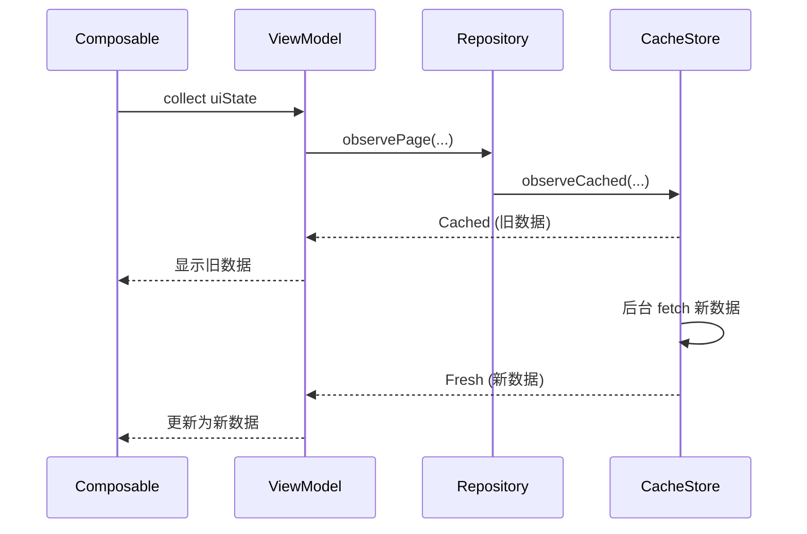

# 第 5 章：协程与 Flow 异步编程

> 📖 本章你将学到：协程解决什么问题、suspend / Flow / StateFlow / SharedFlow 各自的用法和区别、项目里 ViewModel 怎么把 Repository 的 Flow 转成 UI 状态。
> 🔗 前置章节：[第 2 章 现代 Kotlin 速览](02-kotlin-essentials.md)（suspend 关键字）、[第 4 章 依赖注入](04-dependency-injection.md)（ViewModel 注入）
> 📁 项目对应目录：`core/cache/`、`data/repository/`、所有 `*ViewModel.kt`

---

## 5.1 为什么需要协程和 Flow

第 1 章已经埋过一个雷："异步回调嵌套不可读、Thread + Handler 容易泄漏"。本章就把这个雷拆掉。

想象你在写影片详情页：先进详情接口拿基本信息，再用基本信息里的 id 去拿演员列表，最后用演员 id 拿磁力链接。用老式回调写法大概是这样：

```kotlin
// 老写法：三层嵌套，俗称"回调地狱（Callback Hell）"
fetchMovieDetail(movieId) { movie ->
  runOnUiThread {
    fetchActresses(movie.id) { actresses ->
      runOnUiThread {
        fetchMagnets(actresses.first().id) { magnets ->
          runOnUiThread { showUi(movie, actresses, magnets) }   // ← 4 层缩进
        }
      }
    }
  }
}
```

短短三步逻辑，缩进就已经深到看不清主干。一旦业务再加一步"先校验登录"、"失败重试"、"并发拉两张图"，这段代码就彻底没人敢动。更糟的是老写法还有三个隐藏的坑：

### 痛点 1：回调嵌套不可读

每多一步异步，缩进就多一层。主干逻辑（"先拿 A，再拿 B，最后拿 C"）被埋在层层闭包里，错误处理（`onError`）又得每层各写一遍。一段简单的串行流程，写成回调后能膨胀到原来的 3 倍长度。

### 痛点 2：Thread + Handler 容易泄漏

老写法里异步基本靠 `Thread` 或 `AsyncTask`。`Thread` 启动后**不绑生命周期**——Activity 销毁了线程还在跑，只要它持有 Activity 引用就**内存泄漏**。即便不泄漏，频繁创建线程也很贵：每个 Thread 大约占 1 MB 栈空间，开 100 个就 OOM。

### 痛点 3：生命周期对齐难

UI 需要的数据往往来自多个源：缓存一份、网络一份、数据库一份。老写法里你得自己写"先发哪个、后发哪个、谁取消谁、Activity 销毁时一并取消"的协调逻辑——这块代码一旦写错，要么内存泄漏，要么收到结果时 Activity 已经不在了导致崩。

> 协程（Coroutines）+ Flow 把异步写得像同步，把数据流写得像 List 操作。**异步看起来像同步代码**，缩进不会再加深；**生命周期自动绑到 `viewModelScope`**，VM 销毁时协程一起取消；**多个异步值用 Flow 串成数据流**，能用 `map / filter / combine` 这些熟悉的算子组合。

---

## 5.2 协程、suspend、Flow、StateFlow、SharedFlow 是什么

先建立五个名词的直觉。它们各自解决一个具体问题，下一节的最小示例里会逐一演示。

### 1. 协程（Coroutine）

**轻量级线程**。一段代码看起来像同步，实际可以"暂停（挂起）等结果不阻塞线程"。一个 JVM 里能同时跑 10 万个协程，但开 10 万个 Thread 会直接 OOM——这是协程和 Thread 最大的区别。

协程不是"替代" Thread，而是跑在 Thread 上、由调度器（`Dispatchers`）分配。Android 上：

- `Dispatchers.Main` —— 主线程，UI 更新必须切到这里。
- `Dispatchers.IO` —— IO 线程池，网络、磁盘、数据库都走这里。
- `Dispatchers.Default` —— CPU 密集任务（排序、解析、JSON 反序列化）。

### 2. `suspend` 函数

标记"**我可能会暂停**"的函数。`suspend fun` 只能在协程或另一个 `suspend` 函数里调。典型例子：

```kotlin
suspend fun fetchMovie(id: String): Movie { ... }
```

调用方写 `val movie = fetchMovie(id)` 看起来是同步的——拿到结果再继续。但实际执行时协程会在网络请求发起后**挂起**、让出线程给别的协程，等响应回来再恢复。**挂起期间线程不阻塞**，这是协程高性能的根源。

### 3. `Flow<T>`

**冷流（Cold Stream）**，类比"异步的 List"。List 是"现在就有 10 个值，你 for 循环一遍"；Flow 是"值随时间一个个产出，**有人订阅才开始**"。每次订阅都会重新跑一遍——这就是"冷"。

```kotlin
fun movies(): Flow<Movie> = flow {
  emit(load(1))      // 第一次产出
  emit(load(2))      // 第二次产出
  emit(load(3))      // 第三次产出
}
```

`Flow` 像 List 一样支持链式操作：`map`、`filter`、`combine`、`flatMapLatest`，全部是异步的。

### 4. `StateFlow<T>`

**热流（Hot Stream）**——永远有当前值，状态绑定。它**不管有没有人订阅都会保留最新值**，新订阅者一进来立刻拿到当前值。这是 Compose UI 最常用的状态容器：UI 只要 `collect` 它就能拿到"现在应该显示什么"。

### 5. `SharedFlow<T>`

**热流**，事件广播。和 `StateFlow` 不同，它**没有"当前值"概念**——只负责"广播新事件给所有订阅者"。**一次性事件**（Toast、Snackbar、导航跳转、弹窗）必须用 `SharedFlow`：用 `StateFlow` 的话，UI 旋转屏幕重建后会再次拿到同一个事件，导致 Toast 弹两次。

### 速查表

五种类型一张表概括：

| 类型 | 冷/热 | 默认值 | 适合场景 | 项目用法 |
|------|------|-------|---------|---------|
| `suspend fun` | - | - | 一次性异步 | Repository 的 load 方法 |
| `Flow<T>` | 冷 | 无 | 转换链、被订阅才执行 | Repository 内部组合 |
| `StateFlow<T>` | 热 | 有 | UI 状态 | ViewModel 的 `uiState` |
| `SharedFlow<T>` | 热 | 无 | 一次性事件 | VM 事件 → UI Snackbar |

记忆口诀：**"状态用 State，事件用 Shared，请求用 suspend，组合用 Flow"**。

---

## 5.3 最小示例：suspend / Flow / StateFlow 三件套

脱离项目用三段最小代码把核心 API 走一遍，建立直觉。下一节再回到真实项目代码。

### 5.3.1 `suspend fun` —— 一次性异步

```kotlin
// 标了 suspend，调用方会"暂停"等结果
suspend fun fetchMovie(id: String): Movie {
  delay(500)                              // ← 模拟网络延迟，不阻塞线程
  return Movie(id, "示例影片")
}

// 调用：只能在协程或另一个 suspend 函数里
fun load(viewModelScope: CoroutineScope) {
  viewModelScope.launch {                 // ← 启动一个协程
    val movie = fetchMovie("abc")         // ← 看起来像同步，实际挂起
    println(movie.title)
  }
}
```

关键点：`fetchMovie` 标了 `suspend`，但函数体长得和普通函数一模一样——这就是协程的魔力，**异步代码长得像同步代码**。

### 5.3.2 `Flow<T>` —— 异步的多值流

```kotlin
// 冷流：每次 collect 都会重新跑一遍
fun movieStream(ids: List<String>): Flow<Movie> = flow {
  for (id in ids) {
    emit(fetchMovie(id))                  // ← 产出一个值
  }
}

// 订阅
viewModelScope.launch {
  movieStream(listOf("a", "b", "c")).collect { movie ->   // ← 来一个处理一个
    println(movie.title)
  }
}
```

`Flow` 像 List 一样能链式组合：`movieStream(ids).filter { it.id != "b" }.map { it.title }.collect { ... }`，全部是异步的。

### 5.3.3 `StateFlow<T>` —— UI 状态容器

```kotlin
class MyViewModel : ViewModel() {
  // 私有可变 —— 只有 VM 自己能改
  private val _state = MutableStateFlow(UiState(isLoading = true))
  // 公开只读 —— UI 只能读不能改
  val state: StateFlow<UiState> = _state.asStateFlow()

  fun load() {
    viewModelScope.launch {
      _state.value = _state.value.copy(isLoading = true)   // ← 改状态
      val data = fetchMovie("abc")
      _state.value = _state.value.copy(movie = data, isLoading = false)
    }
  }
}

data class UiState(val movie: Movie? = null, val isLoading: Boolean = false)
```

`_state` 私有可变、`state` 公开只读——这是项目的铁则，下节会看到真实写法。UI 只需要 `val state by vm.state.collectAsStateWithLifecycle()`，状态一变 Compose 自动重组。

---

## 5.4 项目中怎么用

本节是全章重点。项目把协程 + Flow 拆成三层使用：Repository 暴露数据流、ViewModel 持有 UI 状态、Cache 层用 sealed 表达三态。

### 5.4.1 Repository 暴露 suspend + Flow

📁 项目对应位置：`app/src/main/java/me/jbusdriver/modern/data/repository/MovieRepository.kt:45`

```kotlin
interface MovieRepository {
  // 一次性：直接拿结果（命中缓存就快、否则联网）
  suspend fun loadPage(
    type: DataSourceType,
    page: Int,
    showAll: Boolean = false,
    forceRefresh: Boolean = false
  ): MoviePageResult

  // 流式：把"缓存命中→后台刷新→新数据/失败"全过程告诉订阅者
  fun observePage(
    type: DataSourceType,
    page: Int,
    showAll: Boolean = false,
    forceRefresh: Boolean = false,
    revalidate: Boolean = true
  ): Flow<CachedLoadEvent<MoviePageResult>>
}
```

**为什么同时暴露两种？** 因为调用场景不同：

- **只想拿一个结果**（比如点开详情页加载）—— 调 `suspend loadPage(...)`，一句话就够。
- **想完整跟踪"先显示缓存、后台拉新、新数据到了再更新"**（比如列表页 SWR 流程）—— 调 `observePage(...)`，订阅 `Flow`，订阅者会按时间顺序收到 `Cached → Fresh`（或 `Failure`）多个事件。

第 8 章讲缓存策略时会展开 SWR 的细节，这里只要记住：**`suspend` 适合"一次性"，`Flow` 适合"持续监听"**。

### 5.4.2 ViewModel 用 StateFlow 持有 UI 状态

📁 项目对应位置：`app/src/main/java/me/jbusdriver/modern/ui/movielist/MovieListViewModel.kt:167`

```kotlin
@HiltViewModel
class MovieListViewModel @Inject constructor(
  private val repository: MovieRepository,
  private val localVideoRepository: LocalVideoRepository
) : ViewModel() {

  // 私有可变 —— 只有 VM 自己 update
  private val _uiState = MutableStateFlow(MovieListUiState())
  // 公开只读 —— UI 只能 collect
  val uiState: StateFlow<MovieListUiState> = _uiState.asStateFlow()

  // 派生状态：把 Room 的 Flow 转成 StateFlow
  val downloadedCodes: StateFlow<Set<String>> =
    localVideoRepository.observeDownloadedCodes()           // ← 冷流 Flow<Set<String>>
      .stateIn(viewModelScope, SharingStarted.WhileSubscribed(5_000), emptySet())
}
```

这里有两个关键点：

**关键点 1：`_uiState` 私有 + `uiState` 公开**。这是项目的铁则：**ViewModel 不能把 `MutableStateFlow` 直接暴露给 UI**——否则 UI 就能反向写状态，状态来源就乱了。`asStateFlow()` 把可变流变成只读流，编译器层面就堵住了"UI 改状态"的可能。

**关键点 2：`stateIn` 把冷流转热流**。`localVideoRepository.observeDownloadedCodes()` 返回的是 `Flow`（冷流）——没人订阅就不跑。但 UI 需要的是"永远有当前值"的状态。`stateIn` 干两件事：

1. 在 `viewModelScope` 里启动一个订阅，让冷流"热起来"；
2. 把产出的最新值缓存在 `StateFlow` 里，新订阅者立刻能拿到。

第三个参数 `emptySet()` 是初始值——VM 刚构造、订阅还没产出数据时，UI 拿到的是空集合而不是 null。

### 5.4.3 CachedLoadEvent 用 sealed 表达三态

📁 项目对应位置：`app/src/main/java/me/jbusdriver/modern/core/cache/CacheModels.kt:12`

```kotlin
sealed interface CachedLoadEvent<out T> {
  data class Cached<T>(val entry: CacheEntry<T>) : CachedLoadEvent<T>     // ← 缓存命中（可能已过期）
  data class Fresh<T>(val entry: CacheEntry<T>) : CachedLoadEvent<T>      // ← 网络新数据
  data class Failure(
    val throwable: Throwable,
    val hadCachedValue: Boolean
  ) : CachedLoadEvent<Nothing>                                            // ← 失败
}
```

结合第 2 章的 `sealed` 知识点：这是一个**闭合的类型层级**，编译器知道只有这三个子类。ViewModel 收到事件后用 `when` 分支处理：

```kotlin
repository.observePage(...).collect { event ->
  when (event) {                          // ← 编译期强制穷举三个分支
    is Cached -> _uiState.update { it.copy(movies = event.entry.value.movies) }
    is Fresh  -> _uiState.update { it.copy(movies = event.entry.value.movies, isLoading = false) }
    is Failure -> _uiState.update { it.copy(error = event.throwable, isLoading = false) }
  }
}
```

如果以后给 `CachedLoadEvent` 加第四个子类（比如 `Loading`），所有 `when` 分支编译就会报错——这正是 sealed 的价值：**编译期帮你检查穷举，不会漏分支**。

### 5.4.4 数据流时序图

把上面三个组件串起来看。一次"打开列表页"的完整数据流：



注意时序：

1. **UI 只订阅 VM 的 `uiState`**——它不知道 Repository、Cache 的存在。这是项目分层的好处：UI 解耦。
2. **VM 收到 `Cached`（旧数据）立刻 `_uiState.update`**——UI 立刻显示老内容，用户感觉"秒开"。
3. **Cache 后台拉到新数据后发 `Fresh`**——VM 再次 `update`，UI 更新到新内容。
4. 如果 Cache 拉新失败，发 `Failure`——VM 决定要不要显示错误（看 `hadCachedValue`，有缓存就静默忽略，没缓存才显示错误）。

这就是项目里俗称的 **SWR（Stale-While-Revalidate）** 模式，第 8 章会展开讲。

---

## 5.5 常见误区与调试技巧

新手用协程 + Flow 最容易栽在这四个坑上。这四条全部对应 `AGENTS.md` 里的明确规则，是项目的硬约束。

### 误区 1：ViewModel 不要用 LiveData 或 callback

**症状**：看到老教程里 ViewModel 暴露 `LiveData<T>` 或 `fun setListener(...)` 给 UI，想照样写。

**为什么不能**：`LiveData` 有生命周期感知但**缺少 Flow 的链式组合能力**（`map / combine / flatMapLatest`），不适合复杂异步流；callback 则把"状态"和"事件"混在 UI 层，状态来源会乱。

**正确做法**：状态用 `StateFlow`，一次性事件用 `SharedFlow`。`AGENTS.md` 里写得明白——"ViewModels must not expose callbacks to the UI; expose state and one-shot events as Flow/StateFlow/SharedFlow instead"。

### 误区 2：`Flow` 收集必须配合 `viewModelScope` / `lifecycleScope`

**症状**：写了 `myFlow.collect { ... }`，但跑起来不工作或协程永不取消。

**原因**：`collect` 是 `suspend` 函数，**必须在协程里调**。如果你在 `init { }` 里直接 `collect`，要么编译报错（不在协程里），要么自己起 `GlobalScope`——后者不绑生命周期，泄漏。

**正确做法**：

- ViewModel 里：`viewModelScope.launch { repo.observePage(...).collect { ... } }`。
- Composable 里：用 `collectAsStateWithLifecycle()`（自动在 `ON_STOP` 暂停收集，省电又安全）。

```kotlin
// ✅ ViewModel 内
init {
  viewModelScope.launch {                  // ← 协程绑 VM 生命周期
    repository.observePage(...).collect { event ->
      // 处理事件
    }
  }
}

// ✅ Composable 内
@Composable
fun MovieScreen(vm: MovieListViewModel) {
  val state by vm.uiState.collectAsStateWithLifecycle()   // ← 自动绑 lifecycle
  MovieList(state)
}
```

### 误区 3：`stateIn` 别忘了 `SharingStarted.WhileSubscribed(5_000)`

**症状**：把 `Flow` 转 `StateFlow` 时图省事写了 `SharingStarted.Eagerly`，或干脆没写 `stateIn`。

**为什么 `WhileSubscribed(5_000)` 是项目默认**：

- `Eagerly` —— VM 一创建就启动订阅，**没人 collect 也跑**，浪费资源。
- `Lazily` —— 第一个订阅者来了才启动，但之后**永不停**。
- `WhileSubscribed(5_000)` —— **有订阅者才启动，最后一个订阅者断开后保留 5 秒再停**。

5 秒延迟是为了应对**配置变化（旋转屏幕）**：旧 Activity 销毁、新 Activity 重建之间会有短暂的"无人订阅"窗口，没有这 5 秒延迟，上游 Flow 会被取消一次再重启，状态丢失、网络请求重发。这是项目里所有 `stateIn` 的标配参数。

### 误区 4：`suspend` 函数不能在主线程调网络

**症状**：写了 `suspend fun fetch(...) { okHttpClient.newCall(...).execute() }`，运行时崩 `NetworkOnMainThreadException`。

**原因**：`suspend` 只是"可以挂起"，**不自动切线程**。如果你在 `suspend` 函数里直接调同步阻塞 API（`execute()`、File 读写、CPU 密集计算），它依然跑在调用方的线程上——通常是主线程，于是崩。

**正确做法**：

```kotlin
suspend fun fetch(url: String): String = withContext(Dispatchers.IO) {  // ← 切到 IO 线程
  okHttpClient.newCall(Request.Builder().url(url).build()).execute()
    .body?.string() ?: ""
}
```

**例外**：Room、OkHttp（用 `enqueue` 异步）、Retrofit 的 `suspend` 接口——这些库**自带线程切换**，调用方不需要手动 `withContext`。项目里的 `NetClient` / `HtmlClient` 已经包好，Repository 直接调即可。

> 小技巧：拿不准要不要切线程时，就记住一条——"凡是同步阻塞 IO 或 CPU 重活，一律 `withContext(Dispatchers.IO or Default)`"。错了 Android 会立刻崩 `NetworkOnMainThreadException`，不会留隐患。

---

## 5.6 小结与下一站

本章从一个痛点出发——"回调嵌套不可读、Thread 容易泄漏、生命周期难对齐"——并把协程 + Flow 作为解法走了一遍：

- **协程（Coroutine）** —— 轻量级线程，让异步代码长得像同步。`viewModelScope.launch { }` 是 Android 入口。
- **`suspend fun`** —— 标记"我会暂停"，只能在协程或另一个 `suspend` 里调。Repository 的 `loadPage` 就是这种。
- **`Flow<T>`** —— 冷流，异步的 List。Repository 内部组合数据流时用。
- **`StateFlow<T>`** —— 热流，永远有当前值，**UI 状态容器**。ViewModel 的 `_uiState` / `uiState` 就是这种。
- **`SharedFlow<T>`** —— 热流，事件广播。一次性事件（Toast、导航）用。
- **项目落地**：Repository 同时暴露 `suspend`（一次性）和 `Flow`（流式）；ViewModel 用 `MutableStateFlow + asStateFlow()` 私有可变公开只读；`CachedLoadEvent` 用 sealed 表达"缓存 / 新数据 / 失败"三态；`stateIn(WhileSubscribed(5_000))` 把冷流转热流。

读完本章，你应该能看懂项目里所有 `viewModelScope.launch { ... }`、`Flow<CachedLoadEvent<...>>`、`MutableStateFlow` 出现的地方，并且知道新增一个 UI 状态时要在 VM 里写 `_state` + `state` 一对。

```
下一站：第 6 章 Repository 模式 —— 既然知道了 Repository 暴露 suspend + Flow，那 Repository 本身是怎么把缓存、网络、解析串起来的？
```

---

🔍 深入阅读：
- 协程官方文档：https://kotlinlang.org/docs/coroutines-overview.html
- Flow 文档：https://kotlinlang.org/docs/flow.html
- 项目内 SWR 数据流的代表文件：`core/cache/CacheStore.kt`、`data/repository/MovieRepository.kt`
