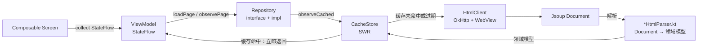

# 第 6 章：Repository 模式与项目数据流

> 📖 本章你将学到：Repository 是什么、为什么 UI 不直接调网络、项目数据流是怎么从网络走到屏幕的。
> 🔗 前置章节：[第 4 章 依赖注入](04-dependency-injection.md)、[第 5 章 协程与 Flow](05-coroutines-flow.md)
> 📁 项目对应目录：`data/repository/`、`data/parser/`、`core/cache/`、`core/http/`

---

## 6.1 为什么需要 Repository

第 4 章讲依赖注入时埋过一个伏笔："`val repo = MovieRepository()` 这种手动 `new` 让测试难"。但即便用 Hilt 把"对象创建"解决了，还有一个更深层的问题没回答：**UI 到底该找谁要数据？**

假设没有任何 Repository，让 ViewModel 直接调网络客户端，看起来也跑得通，但业务一演进，三个坑立刻冒出来：

### 痛点 1：缓存策略散在 UI 里

`MovieListViewModel` 要决定"先读缓存还是先发请求"，`SearchViewModel` 也要决定一遍，`ForumThreadListViewModel` 还要再决定一遍。每个页面各自实现一套"缓存命中就返回、否则发网络"的逻辑，复制粘贴 10 次以后：

- 缓存 TTL 改一个规则，要改 10 个 VM。
- 哪个页面漏了新需求（比如磁盘缓存），只有那条数据出问题才被发现。
- 新人来了完全搞不清"这个页面的缓存到底怎么生效"。

### 痛点 2：测试 UI 必须联网

VM 里直接 `NetClient.fetch(...)`，单测跑起来就真发 HTTP 请求。要么单测连着真网（又慢又脆），要么干脆不写单测。**假的（Fake / Mock）实现塞不进去**，因为 VM 直接持有具体类，没有替换点。

### 痛点 3：UI 和数据格式强耦合

目标站的 HTML 结构一旦变了（比如改了 CSS class 名），所有直接解析 HTML 的 VM 都得跟着改。一个 DOM 选择器的变更，**爆炸半径横跨 5 个屏幕**。本该是个"局部修改"的事，变成"全线回归"。

### Repository 的核心思想

三个痛点的共同根因是：**UI 既管"显示什么"，又管"数据从哪来"**。Repository 模式把这两件事拆开：

> UI 只问 Repository 要数据（要什么、怎么缓存、从哪取），**不关心后端是网络、缓存还是数据库**。

Repository 把"数据从哪里来"这件事集中到一处，UI 只负责消费领域模型。下面三节分别讲：Repository 长什么样（§6.2）、最小示例怎么写（§6.3）、项目里具体怎么用（§6.4）。

---

## 6.2 Repository 是什么

### 1. 核心思想：UI 和数据源之间的中介层

Repository 是 **UI 和数据源（网络 / 缓存 / 数据库）之间的中介层**。UI 不直接接触数据源，全部请求走 Repository。

打个比方：你去餐厅吃饭（UI），不直接冲进后厨（数据源）翻冰箱、开炉子。你只找服务员（Repository）说"我要一份影片列表"，服务员自己去决定是从备餐台（缓存）拿现成的、还是回炉新做（网络请求）。你拿到的永远是装盘的菜（领域模型），不用管后厨的生肉（HTML / JSON 原始数据）长什么样。

这个"中介"层听起来像个传话筒，但它真正的价值在于：**所有"数据从哪来"的决策都集中在这一个地方**，UI 和数据源互不感知。

### 2. 接口与实现分离

项目里每个 Repository 都是 **"interface + impl" 对**：

- `MovieRepository`（接口）：声明有哪些方法，比如 `suspend fun loadPage(...)` 和 `fun observePage(...): Flow<...>`。
- `DefaultMovieRepository`（实现）：真正干活的，决定先查缓存还是先发请求、怎么调解析器。

为什么要分开？这正好呼应第 4 章的 `@Binds`——Hilt 把接口绑到实现：

```kotlin
// 第 4 章见过：DataModule 里把接口绑到实现
@Binds @Singleton
abstract fun bindMovieRepository(impl: DefaultMovieRepository): MovieRepository
```

这样 VM 注入的是**接口类型** `MovieRepository`，不关心背后到底是 `DefaultMovieRepository` 还是测试用的 `FakeMovieRepository`。

### 3. 为什么要分开

三个好处：

- **方便单测**：VM 测试时 mock 一个接口实现，不联网也能跑（详见第 10 章）。
- **方便换实现**：以后想把网络源换成假数据源、加镜像站、加 CDN，只改实现类，接口和所有 VM 都不动。
- **让 UI 不依赖具体数据格式**：HTML 结构变了，只影响 Parser 和 Repository 实现；接口（返回领域模型）不变，UI 不动。

> 一句话：**接口稳定，实现可换**。这就是 Repository 模式 + DI 配合的核心价值。

---

## 6.3 最小示例

下面用一个脱离项目的简化例子（User 仓库）把 Repository 三件套走一遍：interface + impl + ViewModel 调用。建立直觉后，下一节再回到真实项目代码。

```kotlin
// 1️⃣ 接口：声明"能做什么"，不关心"怎么做"
interface UserRepository {
    suspend fun loadUser(id: String): User              // 一次性请求（suspend，第 5 章）
    fun observeUser(id: String): Flow<User>             // 持续观察（Flow，第 5 章）
}

// 2️⃣ 实现：决定"从哪取、怎么缓存"
class UserRepositoryImpl @Inject constructor(
    private val api: UserApi,                           // 网络源
    private val cache: CacheStore                       // 缓存源
) : UserRepository {
    override suspend fun loadUser(id: String): User {
        cache.get<User>(id)?.let { return it }          // 先读缓存
        val fresh = api.fetchUser(id)                   // 没有就发请求
        cache.put(id, fresh)                            // 顺手存进缓存
        return fresh
    }
    override fun observeUser(id: String) =
        cache.observeCached(id) { api.fetchUser(id) }   // SWR 风格（第 8 章）
}

// 3️⃣ ViewModel 只持有接口，不关心实现
@HiltViewModel
class UserViewModel @Inject constructor(
    private val repo: UserRepository                    // ← 注入接口，不是实现
) : ViewModel() {
    fun load(id: String) {
        viewModelScope.launch { repo.loadUser(id) }     // VM 只管调接口
    }
}
```

三件事一眼可见：

1. **VM 不知道 `UserApi` 和 `CacheStore` 的存在**——它只看到 `UserRepository` 这个接口。
2. **缓存逻辑只在 `UserRepositoryImpl` 里写一遍**——10 个 VM 复用同一份策略，改一处全生效（痛点 1 解决）。
3. **测试 `UserViewModel` 时可以塞一个 `FakeUserRepository`**——返回假数据，不联网（痛点 2 解决）。

这就是 Repository 模式的全部核心。下面看项目里真实长什么样。

---

## 6.4 项目中怎么用

本节是全章重点。项目把数据访问拆成 `data/repository/`（约 20 个仓库）+ `data/parser/`（HTML 解析）+ `core/cache/`（缓存）三层。我们以影片数据为例走一遍。

### 6.4.1 接口长什么样

📁 项目对应位置：`app/src/main/java/me/jbusdriver/modern/data/repository/MovieRepository.kt:35`

```kotlin
interface MovieRepository {
    // ── suspend 方法：一次性请求（第 5 章讲过 suspend）──
    suspend fun loadPage(
        type: DataSourceType,
        page: Int,
        showAll: Boolean = false,
        forceRefresh: Boolean = false
    ): MoviePageResult

    // ── default 方法：Flow，SWR 风格（先发缓存，后台再拉新）──
    fun observePage(
        type: DataSourceType,
        page: Int,
        showAll: Boolean = false,
        forceRefresh: Boolean = false,
        revalidate: Boolean = true,
        nowMillis: () -> Long = { System.currentTimeMillis() }
    ): Flow<CachedLoadEvent<MoviePageResult>> = flow {       // ← 方法体写在接口里！
        // 默认实现：调 loadPage，包成 Fresh 事件发射
        val value = loadPage(type, page, showAll, forceRefresh)
        emit(CachedLoadEvent.Fresh(CacheEntry(value, nowMillis(), CacheSource.Network, false)))
    }
}
```

接口里有两类方法，对应两种数据访问模式：

| 方法风格 | 用途 | 返回类型 | 典型场景 |
|---------|------|---------|---------|
| `suspend fun load*` | **一次性请求**——拿一次就够 | 直接返回领域模型（如 `MoviePageResult`） | 加载更多页、详情页初始化 |
| `default fun observe*` | **持续观察**——SWR 风格 | `Flow<CachedLoadEvent<T>>` | 列表首屏、下拉刷新、Tab 切换 |

注意 `observe*` 方法有个 **`default` 实现**——这是 Kotlin 接口的特性，接口可以直接带方法体。`MovieRepository` 接口提供的默认实现是"调 `load*`、然后包成 `Fresh` 事件"，但 `DefaultMovieRepository` **重写**了这些方法，把"先发缓存、后台拉新"的 SWR 逻辑塞进去（第 8 章细讲）。

这样设计的好处：如果某个 Repository 不需要 SWR，直接用接口的默认实现就行，连 `override` 都不用写。

### 6.4.2 DefaultMovieRepository 实现

📁 项目对应位置：`app/src/main/java/me/jbusdriver/modern/data/repository/MovieRepository.kt:194`

```kotlin
@Singleton                                               // ← 单例，全局共享（第 4 章）
class DefaultMovieRepository @Inject constructor(
    private val fetcher: MoviePageFetcher,               // ← 网络取数（第 7 章细讲）
    private val cacheStore: CacheStore,                  // ← 缓存（第 8 章细讲）
    private val siteConfig: SiteConfig                   // ← 站点 URL（运行时配置）
) : MovieRepository {

    override fun observePage(
        type: DataSourceType, page: Int, showAll: Boolean, forceRefresh: Boolean,
        revalidate: Boolean, nowMillis: () -> Long
    ): Flow<CachedLoadEvent<MoviePageResult>> = flow {
        siteConfig.awaitReady()                          // 等 SiteConfig 初始化好
        val baseUrl = siteConfig.baseUrl
        val url = MovieRepositoryUrls.moviePage(baseUrl, type, page)         // 拼 URL
        val cacheKey = MovieRepositoryCacheKeys.moviePage(baseUrl, type, showAll, page)

        cacheStore.observeCached(                        // ← SWR 核心：先发缓存、后台拉新
            key = cacheKey,
            ttlMillis = if (page == 1) MovieCacheTtl.MOVIE_LIST_FIRST_PAGE_MILLIS
                        else MovieCacheTtl.MOVIE_LIST_NEXT_PAGE_MILLIS,
            disk = true,
            forceRefresh = forceRefresh,
            revalidate = revalidate && page == 1
        ) {
            fetcher.fetchMoviePage(url, showAll, baseUrl)  // ← 缓存未命中时的"造数逻辑"
        }.collect { emit(it) }
    }

    // loadPage 直接复用 observePage + firstCachedOrFresh()，不重复实现
    override suspend fun loadPage(...) =
        observePage(..., revalidate = false).firstCachedOrFresh()
}
```

注意这个实现注入了 **3 个协作者**，全部由 Hilt 管理：

| 协作者 | 职责 | 出处 |
|--------|------|------|
| `MoviePageFetcher` | 把 HTML 拉下来 + 调 Parser 解析成领域模型 | `data/repository/MoviePageFetcher.kt`（第 7 章） |
| `CacheStore` | 内存 LRU + 磁盘缓存 + SWR 数据流 | `core/cache/CacheStore.kt`（第 8 章） |
| `SiteConfig` | 运行时站点 URL（支持镜像切换） | `core/site/SiteConfig.kt` |

**Repository 自己不亲自干这些活**——它不直接发 HTTP 请求（那是 `fetcher` 的职责），也不亲自管 LRU（那是 `cacheStore` 的职责）。它只做一件事：**编排（orchestrate）**——把 fetcher + cacheStore + siteConfig 组合起来，决定"先查缓存还是先发请求、缓存多久过期、什么时候后台刷新"。

这是 Repository 模式的精髓：**它是个指挥者，不是执行者**。

### 6.4.3 数据流总览

把前面所有概念串起来，项目里一次"列表页加载"的数据流是这样走的：



这段流程读法（从左到右）：

1. **UI 层**（`Composable`）通过 `collectAsStateWithLifecycle()` 订阅 ViewModel 的 `StateFlow`，状态一变 UI 自动重组。
2. **ViewModel** 调 Repository 的 `loadPage()` 或 `observePage()`，自己不碰网络和缓存。
3. **Repository** 调 `cacheStore.observeCached(...)`，把"造数逻辑"（一个 lambda）交给 CacheStore。
4. **CacheStore** 先查内存/磁盘缓存——命中就立即向下游发一个 `Cached` 事件（UI 立刻有内容显示）。
5. 缓存过期或缺失时，CacheStore 在**后台**调那个 lambda，进入网络分支：`HtmlClient` 用 OkHttp（必要时 WebView 绕反爬）拉 HTML → 得到 Jsoup `Document` → `*HtmlParser.kt` 把 Document 解析成领域模型（如 `MoviePageResult`）。
6. 解析出的领域模型回填进 CacheStore，CacheStore 再向下游发一个 `Fresh` 事件，ViewModel 决定是否立即应用（取决于用户是否在顶部，第 8 章细讲）。

> **关键边界**：Repository 在中间，向上对接 ViewModel（用 Flow），向下对接 CacheStore（缓存）和 HtmlClient（网络）。**HTML 和 `Document` 类型绝不会泄漏到 Repository 接口之上**——接口只返回领域模型。这就是 §6.5"误区 1"要讲的反面教材。

第 7 章会展开讲网络层（HtmlClient + Parser），第 8 章展开讲缓存（CacheStore + SWR），第 10 章展开讲 ViewModel 怎么消费这些 Flow。本章先建立全局图。

### 6.4.4 为什么 interface + impl 分开（回扣第 4 章）

📁 项目对应位置：`app/src/main/java/me/jbusdriver/modern/data/di/DataModule.kt:68`（`@Binds` 绑定见 `:95`）

第 4 章已经讲过 `DataModule` 里那行 `@Binds`：

```kotlin
@Binds @Singleton
abstract fun bindMovieRepository(impl: DefaultMovieRepository): MovieRepository
```

这一行就是把"接口 → 实现"的映射注册给 Hilt。之后任何 VM 写 `@Inject constructor(repo: MovieRepository)`，Hilt 都会自动注入 `DefaultMovieRepository` 的单例实例。

📁 项目对应位置：`app/src/main/java/me/jbusdriver/modern/ui/movielist/MovieListViewModel.kt:160`

```kotlin
@HiltViewModel
class MovieListViewModel @Inject constructor(
    private val repository: MovieRepository,              // ← 接口类型，Hilt 自动注入实现
    private val localVideoRepository: LocalVideoRepository
) : ViewModel()
```

VM 看到的只是 `MovieRepository` 这个接口。这意味着：

- **单测时**可以 mock 一个 `FakeMovieRepository`，返回固定数据，不联网也能验证 VM 的状态机（项目 `app/src/test/` 下有大量这种用法，第 10 章细讲）。
- **以后换实现**（比如把网络源换成本地数据库、加镜像站 fallback），只改 `DefaultMovieRepository` 或新增一个 `MirrorMovieRepository` 然后改 `@Binds`，VM 一行不用动。

> 项目里所有 Repository（约 20 个，涵盖 `MovieRepository`、`MovieDetailRepository`、`SearchRepository`、`ForumRepository`、`CollectRepository`、`MagnetRepository`、`LocalVideoRepository` 等）都是这个"接口 + 实现 + `@Binds`"三件套。统一模式，统一好维护。

---

## 6.5 常见误区与调试技巧

新手第一次写 Repository 最容易栽在这三个坑上。

### 误区 1：Repository 返回了 `Document`（Jsoup 类型）

**症状**：Repository 接口的方法签名写成 `suspend fun loadPage(...): Document`，把 Jsoup 的 HTML 文档对象直接返回给 VM。

**为什么是坑**：这等于让 UI 层依赖 HTML 的具体结构。目标站一旦改 CSS class，原本只该影响 Parser，结果**爆炸半径扩到所有调这个 Repository 的 VM**。Repository 的"屏蔽数据源细节"价值被彻底废掉。

**正确做法**：Repository 接口**只返回领域模型**（如 `MoviePageResult`、`List<ActressInfo>`）。HTML → 领域模型的转换在 Parser 里完成，对 Repository 之上完全不可见。项目里所有 Repository 接口都遵守这条红线——搜遍 `data/repository/` 看不到任何 `Document` 出现在接口签名上。第 7 章会细讲 Parser 在哪条边界上工作。

### 误区 2：ViewModel 绕过 Repository 直接调 NetClient

**症状**：VM 觉得"我就发一个小请求，懒得写 Repository 方法"，直接 `NetClient.fetch(...)`。

**为什么是坑**：这一行代码就绕过了项目的整套缓存策略、`SiteConfig` 站点管理、SWR 数据流。结果就是：这个请求永远不走缓存（每次都耗流量）、永远不响应镜像切换、单测必须联网。

**正确做法**：**VM 永远只调 Repository**。哪怕是个很小的请求，也把它收进对应 Repository 的方法里。如果这个请求确实跨多个 Repository 的职责，考虑新建一个专门的 Repository（项目里 `MagnetRepository`、`LocalVideoRepository` 就是这么来的）。记住口诀：**Repository 是数据进入 VM 的唯一合法入口**。

### 误区 3：把 Repository 接口当"永远不能改"

**症状**：需求变了，但因为"接口要稳定"，不敢动 `MovieRepository`，于是在 VM 里塞各种 `if` 分支去补差。

**为什么是坑**：接口稳定是相对的——**实现可以频繁换，接口随业务演进而演进**。把本该进 Repository 的逻辑堆在 VM 里，反而让 VM 越来越胖、越来越难测。

**正确做法**：接口该加方法就加方法（比如新增 `loadActressDetail()`），该改参数就改参数（用默认参数保持调用方兼容）。项目里 `DataModule @Binds` 的意义是"接口和实现解耦"，不是"接口锁死"。判断标准是：**这个决策属于"数据从哪来"吗？是 → 进 Repository；属于"怎么显示"吗？是 → 留在 VM**。

> 小技巧：判断 Repository 边界划得对不对，问自己一个问题——"如果我要给这个 VM 写单测，能不能不联网就跑？" 如果不能，多半是 Repository 的边界划错了（要么 VM 直接碰了数据源，要么 Repository 返回了不该返回的底层类型）。

---

## 6.6 小结与下一站

本章从一个痛点出发——"UI 直接调数据源导致缓存策略散乱、测试必须联网、数据格式耦合"——并把 Repository 模式作为解法走了一遍：

- **Repository 的角色**：UI 和数据源（网络 / 缓存 / 数据库）之间的中介层。UI 只问 Repository 要数据，不关心后端。
- **接口与实现分离**：项目里约 20 个 Repository 都是"interface + impl"对，由第 4 章的 `@Binds` 串起来。这让 VM 注入接口、单测 mock 接口、日后换实现都成为可能。
- **DefaultMovieRepository 的协作者**：注入 `fetcher`（网络取数）+ `cacheStore`（缓存）+ `siteConfig`（站点 URL）三个 Hilt 管理的对象。Repository 是**指挥者**，不是执行者。
- **项目数据流**：`Composable → ViewModel → Repository → CacheStore + HtmlClient + Parser → 领域模型`。HTML 和 `Document` 类型绝不向上泄漏过 Repository 接口。

读完本章，你应该能看懂项目里所有 `*Repository.kt` 文件的结构，并且新增一个功能时知道：**先定义 Repository 接口、再写实现、最后去 `DataModule` 加一行 `@Binds`**。

```
下一站：第 7 章 网络层与 HTML 解析 —— Repository 里的 fetcher 是怎么真的把 HTML 拉下来、又解析成领域模型的？OkHttp、Jsoup、WebView 反爬都在那一章展开。
```

---

🔍 深入阅读：
- Android 官方 Guide to App Architecture：https://developer.android.com/topic/architecture
- 项目所有 Repository：`app/src/main/java/me/jbusdriver/modern/data/repository/`（约 20 个"接口 + 实现"对）
- 项目所有 Parser：`app/src/main/java/me/jbusdriver/modern/data/parser/`（HTML → 领域模型的边界）
- 第 4 章 `@Binds` 绑定的细节：[04-dependency-injection.md](04-dependency-injection.md) §4.4.2
