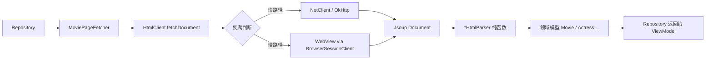

# 第 7 章：网络层与 HTML 解析

> 📖 本章你将学到：OkHttp 怎么发请求、Jsoup 怎么解析 HTML、为什么项目还要 WebView fallback、Parser 是怎么把 HTML 变成领域模型的。
> 🔗 前置章节：[第 5 章 协程与 Flow](05-coroutines-flow.md)（suspend 函数）、[第 6 章 Repository](06-repository-pattern.md)（数据流上下游）
> 📁 项目对应目录：`core/http/`、`data/parser/`

---

## 7.1 为什么网络层难写

第 6 章把 Repository 讲成"UI 问它要数据、它决定从哪取"的中介。但中介也得会真去拿——这一章就回答：**HTML 数据到底是怎么从目标站拉下来、又怎么变成 `Movie`、`ActressInfo` 这些领域模型的？**

移动端抓 HTML 数据，比写后端调 JSON API 难三倍。原因有三个，每一个都得专门解决：

### 痛点 1：网络不稳定

手机网络环境复杂——切换 WiFi/4G/5G、进电梯断网、目标站慢得像爬。直接 `URL.openStream()` 一行代码搞定网络的时代不存在：

- 必须**超时可控**：不能让请求挂在那 30 秒。
- 必须**可取消**：用户切页面，正在跑的请求要立刻终止，否则浪费流量和电量。
- 必须**异步**：网络 IO 不能阻塞主线程，否则 ANR（Application Not Responding）直接弹崩。

### 痛点 2：目标站反爬

目标站首页就有一道"driver-verify"反爬墙——纯 HTTP 客户端拿到的不是页面 HTML，而是一段 JavaScript 跳转脚本。你的代码以为拿到了数据，其实被反爬挡在了墙外。

反爬识别浏览器的逻辑大致是：有没有真实的浏览器引擎执行 JavaScript、有没有合理的 cookie 头。**纯 OkHttp 请求在这道墙前是裸奔的**。

### 痛点 3：HTML 结构会变

JSON API 字段类型稳定、改字段通常会发 deprecation 通知；HTML 返回的是带结构的页面，目标站一改版——CSS class 改名、DOM 层级调整、新增/删除容器——你的代码立刻空指针。

更糟的是 HTML 改版不会有任何通知，今天能跑的代码明天就崩，**没有编译期保护**。

### 项目的解法：四件套

本章把上面三个痛点拆给四个组件来扛：

| 组件 | 扛哪个痛点 | 位置 |
|------|----------|------|
| `NetClient`（OkHttp 封装） | 网络不稳定 | `core/http/NetClient.kt` |
| `HtmlClient`（Hilt 入口） | 反爬 + 路由决策 | `core/http/HtmlClient.kt` |
| `WebViewFactory` | 反爬绕过（真实浏览器） | `core/http/WebViewFactory.kt` |
| `*HtmlParser`（纯函数） | HTML 结构变化（解析边界） | `data/parser/*HtmlParser.kt` |

下面三节分别讲：通用概念（§7.2）、最小示例（§7.3）、项目里实际怎么用（§7.4）。

---

## 7.2 三个核心概念

### 1. OkHttp — Android 生态最主流的 HTTP 客户端

`OkHttp` 是 Square 公司开源的 HTTP 客户端，几乎是 Android 的事实标准。它直接解决"网络不稳定"这件事：

- **拦截器（Interceptor）**：在请求发出前/响应回来后插入自定义逻辑——加 cookie、加 User-Agent、打日志、重试。
- **超时配置**：连接、读取、写入分别可配，互不影响。
- **异步回调**：`call.enqueue(object : Callback { ... })` 把网络 IO 丢到 OkHttp 内部的线程池，调用方不阻塞。
- **连接池复用**：同一站点的多次请求复用 TCP 连接，省握手时间。

典型用法——发请求拿 HTML 字符串：

```kotlin
val client = OkHttpClient.Builder()
    .connectTimeout(15, TimeUnit.SECONDS)
    .readTimeout(20, TimeUnit.SECONDS)
    .build()

val request = Request.Builder().url(url).build()

// 异步：Callback 在 OkHttp 内部线程池执行
client.newCall(request).enqueue(object : Callback {
    override fun onFailure(call: Call, e: IOException) { /* 失败 */ }
    override fun onResponse(call: Call, response: Response) {
        val html = response.body.string()
        // 处理 html
    }
})
```

问题来了——回调风格写起来像 2014 年。第 5 章讲过协程能让异步代码"看起来像同步"，§7.3 就会看到项目怎么把 OkHttp 回调包成 `suspend fun`。

### 2. Jsoup — HTML 解析界的 jQuery

拿到 HTML 字符串后，下一步是"提取里面的数据"。最朴素的做法是正则匹配或字符串查找——但 HTML 嵌套复杂、属性转义、空格变化无穷，正则几乎一定挂。

`Jsoup` 是 Java/Android 生态最主流的 HTML 解析库，API 风格类似 jQuery：**用 CSS 选择器（CSS Selector）定位元素**。

```kotlin
val doc: Document = Jsoup.parse(html)                    // 把字符串解析成 DOM 树

// 类似 jQuery 的 CSS 选择器
val titles: Elements = doc.select(".movie-box a[title]")  // 选所有带 title 的 <a>
val firstHref: String = titles.firstOrNull()?.attr("href") ?: ""
```

常用选择器速查：

| 选择器 | 含义 |
|--------|------|
| `.movie-box` | `class="movie-box"` 的元素 |
| `#avatar-waterfall` | `id="avatar-waterfall"` 的元素 |
| `div > a` | 直接子元素 |
| `a[title]` | 带 `title` 属性的 `<a>` |
| `date:first-of-type` | 第一个 `<date>` 标签 |

一句话总结：**Jsoup 让 HTML 像数据库一样可查询**。

### 3. 反爬策略 — OkHttp 为主，WebView 兜底

最后是反爬。本项目用"两条腿走路"应对 driver-verify 反爬墙：

- **快路径（OkHttp）**：图片、AJAX 接口这种不需要 driver-verify 的请求，直接 OkHttp 拿，快、省电。
- **慢路径（WebView）**：HTML 页面（列表、详情、论坛）有反爬墙，让真实浏览器（`WebView`）渲染一遍——它自带 JavaScript 引擎、自动管理 cookie，反爬识别它为"真浏览器"就会放行。

WebView 跑完后，cookie 被自动写入 Android 的 `CookieManager`，下次 OkHttp 请求可以复用这份 cookie，命中率显著提高。

> 这种"OkHttp 为主、WebView 兜底"的设计是项目网络层的核心技巧，§7.4 会看到 `HtmlClient` 是怎么决定走哪条路的。

---

## 7.3 最小示例

把上面三件事用最小代码走一遍：发请求 + 解析 + 提取。这里脱离项目，用一个通用的"抓一段 HTML，提取所有链接标题"的例子。

### 示例 1：OkHttp + 协程包装

第 5 章讲过 `suspendCancellableCoroutine`——它能把任何回调 API 包成 `suspend fun`。OkHttp 是最典型的应用场景：

```kotlin
import kotlinx.coroutines.suspendCancellableCoroutine
import okhttp3.*
import java.io.IOException

// 把 OkHttp 回调包成 suspend 函数
suspend fun fetchHtml(url: String): String =
    suspendCancellableCoroutine { cont ->
        val request = Request.Builder().url(url).build()
        val call = okHttpClient.newCall(request)

        // ★ 关键：协程取消时，OkHttp Call 也跟着取消，不再吃流量
        cont.invokeOnCancellation { call.cancel() }

        call.enqueue(object : Callback {
            override fun onFailure(call: Call, e: IOException) {
                cont.resumeWith(Result.failure(e))      // 失败 → 抛异常
            }
            override fun onResponse(call: Call, response: Response) {
                val body = response.body.string()
                cont.resumeWith(Result.success(body))    // 成功 → 返回 HTML
            }
        })
    }

// 调用方看起来像同步代码：suspend fun loadData() { val html = fetchHtml(url) }
```

两件事要记牢：

1. **`suspendCancellableCoroutine` 是回调转协程的标准范式**。OkHttp、SensorManager、LocationManager——所有回调 API 都这么包。
2. **`cont.invokeOnCancellation { call.cancel() }` 这一行必须写**。它把"协程取消"和"HTTP 取消"绑死，否则 ViewModel 销毁了请求还在跑，白费流量。

### 示例 2：Jsoup 解析 + CSS 选择器

拿到 HTML 字符串，用 Jsoup 解析并提取：

```kotlin
import org.jsoup.Jsoup

data class LinkItem(val title: String, val url: String)

// 纯函数：输入 HTML，输出结构化数据，无副作用
fun parseLinks(html: String, baseUrl: String): List<LinkItem> =
    Jsoup.parse(html, baseUrl)                          // 解析成 DOM，baseUrl 用来补全相对 URL
        .select("a[href][title]")                       // CSS 选择器：所有有 href + title 的 <a>
        .map { el ->
            LinkItem(
                title = el.attr("title"),               // 取属性
                url = el.absUrl("href")                 // absUrl 自动把相对 URL 拼成绝对
            )
        }
        .filter { it.url.startsWith("http") }           // 过滤无效链接
```

注意这个函数的形状：**输入字符串，输出 `List<LinkItem>`，没有全局状态、没有 IO、没有 Android 依赖**。这种"纯函数"形状是项目 Parser 的核心约束——§7.4 会看到 `*HtmlParser.kt` 全部遵守这条。

---

## 7.4 项目中怎么用

本节是全章重点。沿着数据流走：`NetClient`（最底层 OkHttp）→ `HtmlClient`（决定走 OkHttp 还是 WebView）→ `WebViewFactory`（WebView 创建的抽象）→ `*HtmlParser`（Document → 领域模型）。最后用一段真实的 `MoviePageFetcher` 把四个组件串起来。

### 7.4.1 NetClient — OkHttp 全局封装

📁 项目对应位置：`app/src/main/java/me/jbusdriver/modern/core/http/NetClient.kt:45`

```kotlin
object NetClient {

    // 全局共享的 OkHttpClient：配置了超时、拦截器（Cookie/UA）、日志
    private val okHttpClient by lazy {
        OkHttpClient.Builder()
            .writeTimeout(30_000L, TimeUnit.MILLISECONDS)
            .readTimeout(20_000L, TimeUnit.MILLISECONDS)
            .connectTimeout(15_000L, TimeUnit.MILLISECONDS)
            .addNetworkInterceptor(EXIST_MAGNET_INTERCEPTOR)   // 注入 Cookie + User-Agent
            .cookieJar(CookieManagerCookieJar())               // 自动管理 Cookie
            .build()
    }

    // ★ 核心：suspend 函数，把回调风格的 OkHttp 包成同步风格
    suspend fun fetchDocument(url: String, showAll: Boolean = false): Document {
        val html = fetchHtml(url, showAll)                  // ← suspend，内部用 suspendCancellableCoroutine
        return withContext(Dispatchers.Default) {            // ← 解析放后台线程
            Jsoup.parse(html, url)
        }
    }
}
```

四个关键点：

1. **`object` 单例**：客户端全局只有一份，连接池/线程池共享，省资源。**但 ViewModel 不直接拿它**——而是通过 `HtmlClient`（Hilt 注入），下面会看到为什么。
2. **`by lazy`**：第一次访问才构造，避免 App 启动期被网络客户端拖慢。
3. **`suspend fun fetchDocument`**：把回调风格的 OkHttp 包装成同步风格的 `suspend` 函数——这就是第 5 章协程的实战。返回值直接是 `Jsoup.Document`，下一步交给 Parser。
4. **`withContext(Dispatchers.Default)`**：Jsoup 解析消耗 CPU，放后台线程，不阻塞调用方。

> 小提醒：`EXIST_MAGNET_INTERCEPTOR` 这个拦截器负责往请求里塞 `existmag` Cookie——目标站用这个 Cookie 控制是否展示所有磁力链接。这是"用拦截器做请求统一加工"的典型例子。

### 7.4.2 HtmlClient — Repository 真正调用的入口

📁 项目对应位置：`app/src/main/java/me/jbusdriver/modern/core/http/HtmlClient.kt:31`

Repository **不直接调 `NetClient`**，而是调 `HtmlClient` 接口：

```kotlin
interface HtmlClient {
    suspend fun fetchHtml(url: String, showAll: Boolean = false, referer: String? = null): String
    suspend fun fetchDocument(url: String, showAll: Boolean = false): Document
}

@Singleton                                              // ← Hilt 单例
class DefaultHtmlClient @Inject constructor(
    private val browserSessionClient: BrowserSessionClient   // ← WebView 会话管理
) : HtmlClient {

    override suspend fun fetchDocument(url: String, showAll: Boolean): Document {
        val response = fetchPage(url, showAll)              // ← 决定走 OkHttp 还是 WebView
        return withContext(Dispatchers.Default) {
            Jsoup.parse(response.body, response.finalUrl)
        }
    }

    private suspend fun fetchPage(url: String, showAll: Boolean): HtmlResponse {
        // 默认情况：driver-verify 反爬只对真实浏览器放行，所以走 WebView
        // 配置了 JAVBUS_AUTH_COOKIE 时走 OkHttp 快路径（失败再回退 WebView）
        return if (BuildConfig.JAVBUS_AUTH_COOKIE.isNotBlank()) {
            fetchViaOkHttpWithFallback(url, showAll, referer = null)   // 快路径
        } else {
            val doc = browserSessionClient.fetchDocument(url)          // 慢路径：WebView 渲染
            HtmlResponse(doc.location(), doc.html())
        }
    }
}
```

关键点：

1. **接口 + 实现**：Repository 注入的是 `HtmlClient`（接口），不是 `DefaultHtmlClient`。方便测试时塞假实现——这是第 4 章讲过的"`@Binds` 把接口绑实现"的实战。
2. **`@Singleton` + `@Inject constructor`**：Hilt 单例。整个 App 只有一个 `HtmlClient`，cookie/会话状态跨 Repository 共享。
3. **反爬决策在这里**：`fetchPage` 这个 private 方法是核心——它判断"走 OkHttp 还是 WebView"。这个决策对外完全不可见，调用方只看到一个 `suspend fun fetchDocument(...)`。
4. **`BrowserSessionClient`**：管理共享 WebView 会话（warmup、cookie 同步、URL 加载）。它的实现也用 `WebViewFactory`，下面看。

> `BuildConfig.JAVBUS_AUTH_COOKIE` 是个构建期变量——用户自己配的快速通道 token。默认空字符串，所有 HTML 都走 WebView。把这种"决策由配置驱动"的逻辑集中在 `HtmlClient`，比散在各 Repository 里强一万倍。

### 7.4.3 WebViewFactory — 测试友好的 WebView 抽象

📁 项目对应位置：`app/src/main/java/me/jbusdriver/modern/core/http/WebViewFactory.kt:9`

```kotlin
interface WebViewFactory {
    fun createWebView(): WebView
}

@Singleton
class AndroidWebViewFactory @Inject constructor(
    @param:ApplicationContext private val context: Context
) : WebViewFactory {
    override fun createWebView(): WebView = WebViewHelper.createWebView(context)
}
```

代码极简，但设计意图很重。**为什么要搞个 Factory 只为包一行 `WebView(context)`？**

| 不包 Factory | 包 Factory |
|-------------|-----------|
| 直接 `WebView(context)` | `factory.createWebView()` |
| 测试时无法替换——`WebView` 是 Android 框架类，单测里实例化就崩 | 测试时注入 `FakeWebViewFactory`，返回 mock |
| `BrowserSessionClient` 直接持有 `Context`，耦合 Android | `BrowserSessionClient` 只依赖接口，干净 |

这是第 4 章讲过的"把第三方/框架类包一层接口再注入"的典型应用。**WebView 本身没法改构造函数，所以必须用接口包一层**。同样的模式还适用于 `PackageManager`、`SensorManager`、`NotificationManager` 等所有 Android 系统服务。

### 7.4.4 *HtmlParser — Document 到领域模型的边界

📁 项目对应位置：`app/src/main/java/me/jbusdriver/modern/data/parser/MovieHtmlParser.kt:30`

```kotlin
// 纯函数：输入 Document + baseUrl，输出 List<Movie>，无副作用
fun loadMovieFromDoc(doc: Document, baseUrl: String): List<Movie> =
    doc.select(".movie-box").map { element ->                       // CSS 选择器
        Movie(
            title = element.select("img").attr("title"),            // 取 img 的 title 属性
            imageUrl = element.select("img").attr("src").wrapImage(baseUrl),
            code = element.select("date").getOrNull(0)?.text() ?: "",   // 第一个 <date>
            date = element.select("date").getOrNull(1)?.text() ?: "",   // 第二个 <date>
            link = element.attr("href"),
            tags = element.select(".item-tag").firstOrNull()?.children()?.map { it.text() }
                ?: emptyList()
        )
    }
```

四个关键点：

1. **纯函数（Pure Function）**：输入 `Document`，输出 `List<Movie>`，没有全局状态、没有 IO、不依赖 Android 框架。**这种纯度让你随便单测**——构造一段 fake HTML 字符串，调函数，断言结果。完全不用 Robolectric、不用 mock。
2. **CSS 选择器集中在这里**：不在 Repository、不在 ViewModel，全部在 `data/parser/` 目录。目标站改版改 class 名，只动 Parser，**爆炸半径限制在单文件**。
3. **顶层函数（top-level function）**：不是 `class MovieHtmlParser` 里的方法，而是文件级的 `fun`。因为纯函数不需要持有状态，没必要塞进类里。
4. **`baseUrl` 参数**：HTML 里的链接往往是相对路径（如 `/movie/abc`），需要 `baseUrl` 拼成绝对 URL。Parser 显式要求调用方传入——不依赖任何全局变量（如 `SiteConfig`），保持纯净。

📁 项目对应位置：`data/parser/` 目录下约 8 个 `*HtmlParser.kt` 全部遵守这种"Document → 领域模型"的纯函数风格：

| Parser 文件 | 转换目标 |
|------------|---------|
| `MovieHtmlParser.kt` | `Movie` / `MovieDetail` / `MovieFilterInfo` |
| `ActressHtmlParser.kt` | `ActressInfo` / `ActressAttrs` |
| `GenreHtmlParser.kt` | `Genre` / `GenreGroup` |
| `MagnetHtmlParser.kt` | 磁力链接 |
| `ForumHomeParser.kt` | 论坛板块 |
| `ForumThreadParser.kt` | 帖子列表 |
| `ForumPostParser.kt` | 帖子楼层 + 富文本 |
| `InlineParagraphParser.kt` | 论坛富文本段落 |

### 7.4.5 串起来：MoviePageFetcher

四个组件怎么协作？看一眼 `MoviePageFetcher`——它是 Repository 内部把"网络 + 解析"串起来的小帮手。

📁 项目对应位置：`app/src/main/java/me/jbusdriver/modern/data/repository/MoviePageFetcher.kt:24`

```kotlin
class MoviePageFetcher @Inject constructor(
    private val htmlClient: HtmlClient                       // ← 注入 HtmlClient，不直接拿 NetClient
) {
    suspend fun fetchMoviePage(url: String, showAll: Boolean, baseUrl: String): MoviePageResult {
        val doc = htmlClient.fetchDocument(url, showAll)     // ① HtmlClient 决定走 OkHttp 还是 WebView
        val pageInfo = parsePageInfo(doc) ?: PageInfo(1, 1)  // ② 调 Parser 纯函数
        val movies = loadMovieFromDoc(doc, baseUrl)          // ② 调 Parser 纯函数
        val filterInfo = parseMovieFilterInfo(doc)           // ② 调 Parser 纯函数
        return MoviePageResult(pageInfo, movies, filterInfo) // ③ 组装成领域模型返回
    }
}
```

一眼就能看清整条数据流：



- **`HtmlClient` 是入口**：决定走 OkHttp 还是 WebView，封装反爬复杂性。
- **`*HtmlParser` 是出口**：把 Jsoup `Document` 转成领域模型，把"HTML 结构变化"隔离在 Parser 边界内。
- **Repository 完全看不见 HTML**：它拿到的就是 `MoviePageResult`，干净的数据类。这就是第 6 章说的"Repository 接口只返回领域模型"的实现路径。

---

## 7.5 常见误区与调试技巧

写网络层和解析器时，下面三个坑几乎人人踩过。

### 误区 1：在主线程做 HTTP 或 Jsoup 解析

**症状**：App 偶尔弹"Application isn't responding"，或者直接 `NetworkOnMainThreadException` 崩溃。

**原因**：主线程不能做任何阻塞 IO——HTTP 请求、Jsoup 解析、文件读写都属于这一类。主线程被卡住超过 5 秒，系统就弹 ANR；网络 IO 直接抛异常。

**怎么修**：

1. 所有网络/解析都走 `suspend fun`——OkHttp 内部用线程池，协程自动切线程。
2. Jsoup 解析要主动 `withContext(Dispatchers.Default)`——它是 CPU 密集型，不切线程会卡调用者。项目里 `NetClient.fetchDocument` 和 `DefaultHtmlClient.fetchDocument` 都这么写。
3. ViewModel 调这些函数时一律放在 `viewModelScope.launch { }` 里，scope 销毁自动取消。

### 误区 2：解析器写了状态（破坏纯度）

**症状**：第一次调 `loadMovieFromDoc` 正常，第二次返回空列表；或者并发调用时数据串。

**原因**：Parser 里写了 `var count = 0` 这种成员变量/全局变量，多次调用共享状态。互相干扰，纯度被破坏。

**怎么修**：

- **Parser 必须是纯函数**——所有"状态"通过参数传入，所有"结果"通过返回值传出。如果解析过程真的需要中间状态（比如计数），把它做成函数内的局部 `val`/`var`，函数返回就销毁。
- 项目所有 `*HtmlParser.kt` 都遵守这条——`loadMovieFromDoc` 里 `doc.select(...).map { ... }` 完全是表达式，没有任何成员状态。
- 如果一定要持有状态，那不是 Parser 的职责——把状态挪到 Repository 里。

### 误区 3：新增解析靠看代码不看真实 HTML

**症状**：照着某个 `*HtmlParser.kt` 改了 selector，跑起来返回空列表。用浏览器一看目标站，class 根本对不上。

**原因**：把"代码里写的 selector"当成"目标站的 HTML 结构"。代码只是结构的一种实现，目标站改版了代码就跟不上。

**怎么修**：

1. **永远用浏览器 inspect 实际 HTML**——Chrome 打开目标页面，F12 → Elements，看真实的 class、id、DOM 嵌套。
2. **写一个最小测试**——在 `app/src/test/` 下放一份 HTML 字符串样本（复制粘贴真实页面），调 Parser 函数断言结果。下次目标站改版，CI 会立刻红。
3. **CSS 选择器写保守一点**——优先用语义化的 class（如 `.movie-box`），避免依赖深层 DOM 层级（如 `div > div > div > a`）。后者目标站稍微调一下结构就崩。

> 调试技巧：项目 `OkHttpClient` 在 debug 构建里加了 `HttpLoggingInterceptor`（见 §7.4.1）。Logcat 过滤 `OkHttp` 标签能直接看到请求 URL 和响应状态码——这是排查"是不是被反爬了"的第一手工具。

---

## 7.6 小结与下一站

本章把网络层和 HTML 解析走了一遍：

- **网络层四件套**：`NetClient`（OkHttp 全局封装 + `suspend fun` 包装回调）→ `HtmlClient`（Hilt 注入的入口，决定走 OkHttp 还是 WebView，封装反爬决策）→ `WebViewFactory`（测试友好的 WebView 抽象）→ `*HtmlParser`（Document → 领域模型的纯函数边界）。
- **三个核心库**：OkHttp（HTTP）、Jsoup（解析）、Android WebView（反爬绕过）。三者各司其职，由 `HtmlClient` 统一调度。
- **关键设计**：Parser 必须保持纯函数——可单测、可隔离 HTML 结构变化、爆炸半径最小。Repository 永远不直接碰 HTML，只调 `HtmlClient.fetchDocument(...)` + `loadMovieFromDoc(...)`。

读完本章，你应该能：

- 看懂项目里 `data/repository/` 所有 Repository 怎么把"网络 + 解析"串起来（模板就是 `MoviePageFetcher`）。
- 在目标站改版时知道去哪改——`data/parser/` 下对应的 `*HtmlParser.kt`。
- 在新增一个抓取目标时知道要做什么——加 Parser 函数 + 在 Repository 里调一次 `HtmlClient.fetchDocument(...)`。

```
下一站：第 8 章 缓存与 SWR 策略 —— 数据拿到了，但每次都重新下载太慢；项目怎么缓存、怎么"先显示旧的后台刷新新的"？
```

---

🔍 深入阅读：
- OkHttp 官方文档：https://square.github.io/okhttp/
- Jsoup 官方文档：https://jsoup.org/
- 项目所有 Parser：`data/parser/`（约 8 个 `*HtmlParser.kt`）
- 第 6 章数据流回顾：[06-repository-pattern.md](06-repository-pattern.md)
