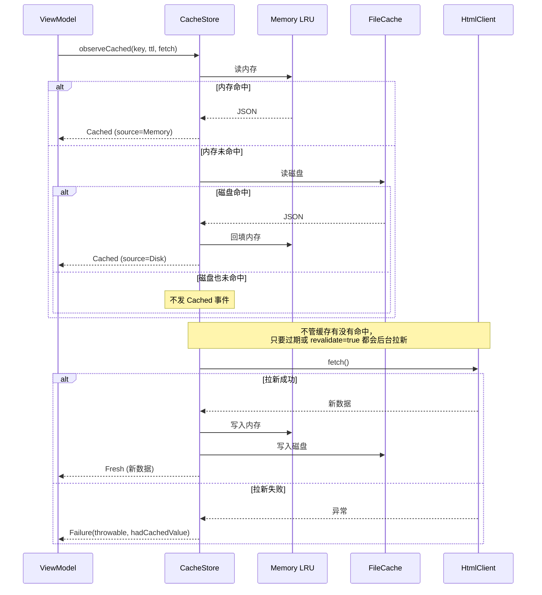

# 第 8 章：缓存与 SWR 策略

> 📖 本章你将学到：内存缓存（LRU）和磁盘缓存怎么配合、SWR（Stale-While-Revalidate）是什么、项目里的 CacheStore 怎么用、分页 SWR 的"在顶部才自动刷新"是怎么实现的。
> 🔗 前置章节：[第 5 章 协程与 Flow](05-coroutines-flow.md)（CachedLoadEvent、Flow）、[第 6 章 Repository](06-repository-pattern.md)
> 📁 项目对应目录：`core/cache/`、`data/cache/`

---

## 8.1 为什么需要缓存和 SWR

第 6 章讲 Repository 时埋过一个伏笔："Repository 调 `cacheStore.observeCached(...)`，命中缓存就立即向下游发 `Cached` 事件"。本章就把缓存这条线拆透。

假设没有任何缓存，每次进影片列表都重新下载——听起来"够用"，但三个痛点立刻冒出来：

### 痛点 1：慢

用户每次打开页面都要等 1～2 秒看 loading 转圈。列表页一秒进、详情页又一秒进，Tab 切来切去每次都重新等。**移动端用户的耐心只有 100 毫秒级**——超过这个时间就会感觉"卡"，体验断崖式下跌。

### 痛点 2：流量贵

目标站的影片列表、演员列表这类数据**短时间内几乎不变**。同一天里你打开 10 次首页，每次都重新下载完全相同的几百 KB HTML——既费用户的流量，又给目标站服务器添压力，还容易被当成爬虫封 IP。

### 痛点 3：离线不可用

地铁里、电梯里、信号差的地方，网络请求一失败 UI 就完全打不开 App——明明几分钟前才看过这个列表，现在却因为"没缓存"而一片空白。

### "加缓存"又带来新问题

最直觉的解法是"把下载的数据存起来，下次先进缓存"。但缓存本身又引出三个新问题：

1. **缓存什么时候过期？** 存 1 小时？1 天？影片列表 1 小时变一次，演员信息可能一个月不变——同一个 TTL 肯定不行。
2. **过期了用户正在看老数据怎么办？** 直接替换会让 UI 闪一下、滚动位置丢掉；不替换又永远显示过期内容。
3. **后台拉到新数据要不要打断用户？** 用户正滑到第 5 页阅读，第 1 页的新数据突然插进来，列表"跳回去"——体验崩。

项目用 **SWR（Stale-While-Revalidate）** 策略解决这三个问题：**先返回老数据让 UI 立即显示，后台同时拉新数据，新数据到了再决定怎么更新。** 这一节先把概念讲清楚，下一节看项目怎么落地。

---

## 8.2 缓存与 SWR 是什么

### 1. LRU 内存缓存

**LRU（Least Recently Used，最近最少使用）** 是一种淘汰策略：内存容量有限，**满了就丢最久没用过的那条**。打个比方，你的书桌只能放 5 本书（容量限制），新拿一本书放不下时，你会把"最久没翻过的那本"放回书架——这就是 LRU。

项目里的内存缓存基于 Android 的 `LruCache`：

- **按字节计容量**，不是按条数（因为缓存的是 JSON 字符串，大小不均）。
- 容量上限根据 `ActivityManager.availMem` 动态决定：可用内存 > 64 MB 时分 32 MB，否则只分 8 MB（低内存设备保护）。
- **进程被杀就全没了**——内存缓存只是"会话级"缓存，重启 App 不保留。

### 2. 磁盘缓存（FileCache）

写到文件系统，**App 重启还在**。项目里的 `FileCache` 把每个 key 当一个文件写到 `cacheDir/ACache/` 目录，容量上限 300 MB，满了按 LRU 删旧文件。

但磁盘缓存有代价：

- **读写慢**：每次都要序列化（Gson）+ 文件 IO，比内存慢几个数量级。
- **类型安全丢失**：存进去的是 JSON 字符串，读回来要手动反序列化成对象，泛型擦除问题、字段重命名问题都会在这暴露（见 §8.5 误区 3）。
- **必须切线程**：磁盘 IO 不能在主线程做，项目用 `withContext(Dispatchers.IO)` 包好。

### 3. SWR（Stale-While-Revalidate）

**Stale-While-Revalidate** 是 HTTP 缓存标准（RFC 5861）里的术语，字面意思是"用过期的同时重新校验"。它的数据流是这样的：

1. UI 要数据 → 先查缓存。
2. **缓存命中就立即返回**（哪怕已经过期，UI 也先显示着）——这一步叫 "stale"。
3. **同时后台发请求拉新数据**——这一步叫 "revalidate"。
4. 新数据到了，再决定怎么合并到 UI（立即替换 / 暂存待用户回顶部 / 静默忽略）。

对比"先 loading 再显示"的老式流程，SWR 的体验是"**秒开老内容 → 顶部进度条提示正在刷新 → 新数据到了静默更新**"。用户感觉 App 又快又新。

### 三层缓存对照表

把三种数据源放一起看：

| 层 | 速度 | 持久性 | 容量 | 项目实现 |
|---|------|--------|------|---------|
| 内存 LRU | 极快（ns） | 进程死即失 | 受 `ActivityManager.availMem` 限制（8 / 32 MB） | `LruCache` in `DefaultCacheStore` |
| 磁盘 FileCache | 中（ms） | App 重启还在 | 受磁盘空间限制（300 MB） | `FileCache` |
| 网络 | 慢（100 ms ~ s） | 永远最新 | 无限 | `HtmlClient`（OkHttp + WebView fallback） |

项目的缓存策略就是**这三层叠加**：先查内存、再查磁盘、最后才发网络。SWR 在这个基础上加了"后台并发拉新"的逻辑。

---

## 8.3 最小示例

脱离项目，先用两段最小代码建立直觉：一个"会缓存的对象"、一段"SWR 风格的 Flow"。

### 最简缓存：内存 + 磁盘

```kotlin
// 一个最简的缓存：内存放一份、磁盘放一份
class SimpleCache(private val cacheDir: File) {
    private val memory = mutableMapOf<String, String>()    // 内存层

    fun readMemory(key: String): String? = memory[key]

    fun writeMemory(key: String, value: String) { memory[key] = value }

    suspend fun readDisk(key: String): String? = withContext(Dispatchers.IO) {
        File(cacheDir, key).takeIf { it.exists() }?.readText()   // 磁盘层
    }

    suspend fun writeDisk(key: String, value: String) = withContext(Dispatchers.IO) {
        File(cacheDir, key).writeText(value)
    }
}
```

注意两点：

1. **内存层是同步的**（`fun`），磁盘层是 `suspend`（因为文件 IO 必须切线程）——这正是项目 `CacheStore` 接口的形状。
2. 这里用 `Map` 没有淘汰策略，生产代码会 OOM。项目用 `LruCache` 解决，下一节看。

### 最简 SWR：Flow 串起来

```kotlin
// SWR 的灵魂：先发缓存，后台再拉新，新数据到了再发一次
fun simpleSwr(
    key: String,
    fetch: suspend () -> String
): Flow<String> = flow {
    val cached = readFromCache(key)
    if (cached != null) emit(cached)                  // ① 立即发老数据（stale）

    val fresh = fetch()                               // ② 后台拉新（revalidate）
    writeToCache(key, fresh)                          // 顺手落缓存
    emit(fresh)                                       // ③ 新数据到了再发一次
}
```

订阅者会按时间顺序收到两次值（或一次，如果缓存没命中）：先老后新。**UI 拿到第一次就能显示**，不用等网络。项目的 `observeCached` 比这复杂得多（处理失败、过期、退化结果），但核心就是这个 shape。

---

## 8.4 项目中怎么用

本节是全章重点。项目把缓存拆成 **接口 + 实现**（`CacheStore` / `DefaultCacheStore`），再在上面提供三种策略函数（`lruCached` / `persistentCached` / `observeCached`），最后用 `PagedSwrState` 解决分页场景的"何时应用新数据"问题。

### 8.4.1 CacheStore 接口与实现

📁 项目对应位置：`app/src/main/java/me/jbusdriver/modern/core/cache/CacheStore.kt:23`

```kotlin
interface CacheStore {
    fun readMemory(key: String): String?
    fun writeMemory(key: String, value: String)
    suspend fun readDisk(key: String): String?
    suspend fun writeDisk(key: String, value: String)
}
```

接口只暴露**最底层的 4 个操作**：内存读写（同步）、磁盘读写（`suspend`）。注意接口里**没有泛型 `<T>`**——它只认 `String`（JSON 字符串），类型反序列化由上层的扩展函数处理。这样接口极简、好测试、好替换。

📁 项目对应位置：`app/src/main/java/me/jbusdriver/modern/core/cache/CacheStore.kt:30`

```kotlin
@Singleton                                       // Hilt 单例（第 4 章）
class DefaultCacheStore @Inject constructor(
    @param:ApplicationContext private val context: Context
) : CacheStore {
    private val memoryCache: LruCache<String, String> by lazy { initMemoryCache() }

    private val diskCache: FileCache by lazy {
        FileCache(File(appContext.cacheDir, "ACache"), 300.MB.toLong())   // 磁盘 300 MB
    }

    override fun readMemory(key: String): String? = memoryCache.get(key)
    override fun writeMemory(key: String, value: String) { memoryCache.put(key, value) }

    override suspend fun readDisk(key: String): String? =
        withContext(Dispatchers.IO) { diskCache.get(key) }    // 切 IO 线程
    override suspend fun writeDisk(key: String, value: String) {
        withContext(Dispatchers.IO) { diskCache.put(key, value) }
    }

    private fun initMemoryCache(): LruCache<String, String> {
        val availMem = ...                                   // 读 ActivityManager.availMem
        val cacheSize = if (availMem > 64.MB) 32.MB else 8.MB   // 低内存降级
        return object : LruCache<String, String>(cacheSize) {
            override fun sizeOf(key: String, value: String): Int = value.toByteArray().size
        }
    }
}
```

三个关键点：

1. **`@Singleton` + `@Inject`**：Hilt 帮忙造一份全局共享的缓存，所有 Repository 注入的都是同一个实例（第 4 章讲过）。
2. **`by lazy`**：内存和磁盘缓存都是**首次访问时才初始化**——App 启动时不做重活，加快冷启动。
3. **`sizeOf` 按字节算**：默认 `LruCache` 按条数计，但 JSON 字符串大小差异巨大（一个详情可能比一条记录大 100 倍），所以必须重写 `sizeOf` 按字节数计。

### 8.4.2 三种缓存策略：`lruCached` / `persistentCached` / `observeCached`

`CacheStore` 接口本身只有底层读写，直接用很啰嗦。项目在上面包了三个扩展函数，对应三种使用场景。

📁 项目对应位置：`app/src/main/java/me/jbusdriver/modern/core/cache/CacheStore.kt:87`（`lruCached`）、`:102`（`persistentCached`）、`:209`（`observeCached`）

| 函数 | 写入内存 | 写入磁盘 | 返回类型 | 适合场景 |
|------|---------|---------|---------|---------|
| `lruCached` | ✅ | ❌ | `suspend T` | 易变列表（首页、搜索） |
| `persistentCached` | ✅ | ✅ | `suspend T` | 稳定详情（电影详情、演员信息） |
| `observeCached` | ✅ | ✅ | `Flow<CachedLoadEvent<T>>` | SWR 流（列表 SWR、详情 SWR） |

`lruCached` 只用内存层，**重启就丢**，适合"短时间内重复访问、但不需要持久化"的数据（比如搜索关键词自动补全）；`persistentCached` 内存磁盘都写，**重启还在**，适合稳定内容（比如电影详情，一周内基本不变）；`observeCached` 是 SWR 核心，返回一个 `Flow`，订阅者会按时间顺序收到 `Cached → Fresh`（或 `Failure`）事件——这是大部分列表屏用的。

```kotlin
// 用法对比
suspend fun loadDetail(url: String): MovieDetail =
    cacheStore.persistentCached(key = "detail:$url") {
        fetcher.fetchDetail(url)                       // 缓存未命中时才调
    }

fun observeList(url: String): Flow<CachedLoadEvent<MoviePageResult>> =
    cacheStore.observeCached(
        key = "list:$url",
        ttlMillis = 10_000,                            // 10 秒内不后台刷新
        disk = true,
        fetch = { fetcher.fetchList(url) }
    )
```

注意 `persistentCached` 返回直接是 `T`（一次性），`observeCached` 返回 `Flow<CachedLoadEvent<T>>`（持续事件流）——这呼应了第 5 章讲的"Repository 同时暴露 `suspend` 和 `Flow` 两种 API"。

### 8.4.3 `observeCached` 的 SWR 流程（核心）

把 `observeCached` 的执行时序画出来，一眼就能看懂 SWR 怎么走的：



读法（从上到下就是时间线）：

1. **VM 调 `observeCached(...)`**，传入缓存 key、TTL、和"造数 lambda"（拉网络 + 解析）。
2. **CacheStore 先查内存**——命中就立即向 VM 发 `Cached` 事件（`source=Memory`），UI 立刻有内容显示，**用户感觉秒开**。
3. **内存没命中就查磁盘**——命中同样发 `Cached`（`source=Disk`），并顺手**回填内存**（下次就不用再读磁盘了）。
4. **两层都没命中，就不发 `Cached`**——UI 显示 loading。
5. **不管缓存有没有命中**，只要 `forceRefresh`、缓存过期、或 `revalidate = true`，CacheStore 都会在**后台**调那个 `fetch` lambda 进入网络分支。
6. **网络成功** → 写内存 + 写磁盘 + 发 `Fresh` 事件。VM 决定是否立即应用到 UI（看用户是不是在顶部，§8.4.4 细讲）。
7. **网络失败** → 发 `Failure(throwable, hadCachedValue)`。`hadCachedValue` 告诉 VM"前面有没有发过缓存"——有缓存就静默吞掉错误（用户已经在看老内容，不用弹错误），没缓存才显示错误页。

注意第 5 章讲过的 `CachedLoadEvent` 是个 `sealed interface`，编译器强制 VM 用 `when` 穷举三个分支（`Cached` / `Fresh` / `Failure`），不会漏处理。这里不重复展开了。

### 8.4.4 PagedSwrState：分页 SWR 的"在顶部才自动刷新"

SWR 有个隐藏的坑：**分页列表里，用户已经滚到第 3 页，第 1 页的新数据来了直接替换会发生什么？** ——列表会"跳回第 1 页"，用户的阅读位置、已加载的多页数据全部丢掉。这个体验比"不刷新"还糟。

项目的解法是把"何时应用 Fresh"的决策抽出来，集中在 `PagedSwrState.kt` 里。

📁 项目对应位置：`app/src/main/java/me/jbusdriver/modern/core/cache/PagedSwrState.kt`

```kotlin
/** "列表是否处于顶部"的开关 */
class AtTopGate(var isAtTop: Boolean = true)

/** 后台 revalidate 拿到新首页数据后的处理结果 */
enum class FreshRevalidateOutcome {
    ApplyImmediately,   // 用户在顶部：直接替换
    StorePending,       // 不在顶部且数据有变化：暂存 + Snackbar 提示
    NoChange            // 数据无变化：什么都不做
}

/** 决策函数：纯函数，输入"当前列表 + 新首页 + 是否在顶部"，输出该怎么做 */
fun <I> decideFreshRevalidate(
    currentItems: List<I>,
    freshItems: List<I>,
    isAtTop: Boolean
): FreshRevalidateOutcome = when {
    isAtTop -> FreshRevalidateOutcome.ApplyImmediately
    currentItems.take(freshItems.size) != freshItems -> FreshRevalidateOutcome.StorePending
    else -> FreshRevalidateOutcome.NoChange
}
```

ViewModel 用法大致是：

```kotlin
private val atTopGate = AtTopGate(isAtTop = true)
private var pendingFirstPage: MoviePageResult? = null

// UI 通过 LazyListState 监听滚动，更新 atTopGate
fun onScrollStateChange(isAtTop: Boolean) { atTopGate.isAtTop = isAtTop }

fun revalidate() {
    viewModelScope.launch {
        repository.observePage(...).collect { event ->
            when (event) {
                is Fresh -> when (decideFreshRevalidate(
                    currentItems = uiState.value.movies,
                    freshItems = event.entry.value.movies,
                    isAtTop = atTopGate.isAtTop
                )) {
                    ApplyImmediately -> _uiState.update { it.copy(movies = event.entry.value.movies) }
                    StorePending -> {
                        pendingFirstPage = event.entry.value
                        _uiState.update { it.copy(hasPendingRefresh = true) }   // 触发 Snackbar
                    }
                    NoChange -> { /* 静默 */ }
                }
                is Cached, is Failure -> { /* 见第 5 章 */ }
            }
        }
    }
}
```

整套逻辑的精妙之处：

- **`AtTopGate` 是个可变开关**——UI 的 `LazyListState` 监听滚动，第一项可见时设为 `true`，否则 `false`。SWR 决策时读这个开关。
- **`decideFreshRevalidate` 是纯函数**——同样的输入永远同样的输出，好测试、好理解。ViewModel 只管调它，不写分支逻辑。
- **数据无变化时什么都不做**（`NoChange`）——避免无意义重组，也避免 Snackbar 烦人。

这就是为什么用户在影片列表滚到第 5 页时，即使后台拉到了新首页数据，列表也不会"跳回去"——只是底部悄悄弹个 Snackbar"有新数据"，用户点一下才回到顶部应用。

### 8.4.5 站点感知的缓存键

最后一个关键细节：**缓存键为什么要带站点？**

项目支持镜像站切换（第 7 章细讲）——同一个相对路径 `/movies`，在 `https://site-a.com` 和 `https://site-b.net` 返回的可能是完全不同的内容（不同镜像站数据源不同）。如果缓存键只写 `"movies"`，用户从镜像 A 切到镜像 B 后，App 会显示镜像 A 的老缓存——**数据串了**。

📁 项目对应位置：`app/src/main/java/me/jbusdriver/modern/data/cache/SiteCacheKey.kt`

```kotlin
internal fun siteCacheKey(baseUrl: String, namespace: String, identity: String): String =
    "$namespace:${normalizeBaseUrl(baseUrl)}:$identity"
```

格式是 `namespace:baseUrl:identity`，比如 `"movie:https://site-a.com:movies/page/1"`。**站点 URL 是缓存键的一部分**，镜像一切换，缓存键变了，自然不会命中老站数据。

这是项目里所有 Repository 拼 cache key 的统一入口（`MovieRepository`、`ForumRepository`、`SearchRepository` 都用），避免每个仓库各写一套容易出错的拼接逻辑。

---

## 8.5 常见误区与调试技巧

新手第一次写缓存最容易栽在这三个坑上。这三条全部对应 `AGENTS.md` 里的明确规则。

### 误区 1：缓存键不带 URL / 参数 / 站点

**症状**：写了 `cacheStore.observeCached(key = "movies", ...)`，结果不同页面之间数据串了，或者镜像切换后显示老站内容。

**为什么是坑**：缓存键是**唯一标识**，所有参数都必须进键。`"movies"` 这一个键会被首页、搜索、演员影片列表共用——第一个页面写进去的数据，第二个页面读出来直接显示，逻辑彻底错乱。

**正确做法**：缓存键要包含**所有影响结果的参数**——URL、页码、查询关键词、站点。项目用 `SiteCacheKey.siteCacheKey(baseUrl, namespace, identity)` 统一拼，自动把站点 URL 加进去。判断标准：**"两个请求要返回不同数据吗？" 是 → 这两个请求的 cache key 必须不同**。

### 误区 2：SWR 的"应用 Fresh"不看用户位置

**症状**：列表页 SWR 流跑通了，但用户滚到第 5 页时，后台拉到新首页数据直接 `_uiState.update { ... }` 替换——列表"跳回第 1 页"，用户阅读位置丢失。

**为什么是坑**：SWR 的"先返回老数据 + 后台拉新"逻辑本身没错，但**"新数据到了要不要立即应用"是另一个独立的决策**。无脑替换会打乱用户的滚动位置；无脑暂存又违背 SWR 的"实时性"承诺。必须区分"用户在顶部"和"用户在滚动中"两种情况。

**正确做法**：所有分页 ViewModel 的 `revalidate()` Fresh 分支必须走 `decideFreshRevalidate(currentItems, freshItems, isAtTop)`——在顶部就直接应用，不在顶部就 `StorePending` 暂存并提示。`AGENTS.md` 的"测试 SWR 行为时要验证滚动位置保留"就是冲这条来的。手动测试见根目录的 `TEST_CASES.md`。

### 误区 3：缓存对象没考虑 Gson 序列化 / R8 混淆

**症状**：Debug 构建缓存好好的，Release 构建一打开就崩在 `fromJson`，或者反序列化出来的对象字段全是 null。

**为什么是坑**：磁盘缓存把对象用 Gson 序列化成 JSON 存到文件。两个隐患：

1. **多态类型反序列不回来**：如果缓存的是 `sealed` / 抽象类，Gson 不知道具体子类，要写自定义 `TypeAdapter`（项目里的 `ContentBlockJsonAdapter` 就是干这个的，详见第 12 章）。
2. **R8 混淆把字段名改了**：Release 构建会把 `data class Movie(...)` 的字段名改成 `a`、`b`、`c`，存进去的 JSON 是 `{"a": "..."}`，但下次启动反序列化时如果 `Movie` 的字段又被混淆成不同的名字，就反序列不出来。

**正确做法**：

- 所有进缓存的模型类必须加 ProGuard keep 规则（项目 `app/proguard-rules.pro` 里 `-keep class me.jbusdriver.modern.domain.model.* { !static !transient <fields>; }` 这条就是保所有领域模型字段名，详见附录 A1）。
- 删除 / 重命名字段时，要加 `@SerializedName(aliases = ["oldName"])` 兼容老缓存，否则老用户升级后读不回旧缓存。
- 改完 Gson / ProGuard / R8 相关代码，**一定要跑一次 Release 构建冒烟测试**——Debug 不会触发混淆，问题藏到上线才暴露。`AGENTS.md` 的"改 Gson/ProGuard/R8 后验证 representative JSON payloads"就是这条。

> 小技巧：调试缓存问题时，先在 `CacheStore` 里加日志（项目里 `KLog.t(TAG).d(...)` 已经有），看 key 命中没、JSON 长什么样。实在找不着原因，用 `TEST_CASES.md` 里的 `cacheRefreshTestMode` 构建模式，TTL 缩到 10 秒、Fresh 数据会移除首项，肉眼就能看到缓存和刷新的区别。

---

## 8.6 小结与下一站

本章从一个痛点出发——"没缓存导致慢、费流量、离线不可用，但加了缓存又面临过期、用户位置、序列化等新问题"——并把项目的缓存体系作为解法走了一遍：

- **三层缓存**：内存 LRU（极快但易失）、磁盘 FileCache（中速但持久）、网络（最慢但最新）。项目用 `DefaultCacheStore` 把内存 + 磁盘统一在一个接口下。
- **三种策略 API**：`lruCached`（仅内存，易变列表）、`persistentCached`（内存 + 磁盘，稳定详情）、`observeCached`（SWR Flow，列表 SWR 流）。返回类型从 `suspend T` 到 `Flow<CachedLoadEvent<T>>` 对应不同使用场景。
- **SWR = Stale-While-Revalidate**：先返回缓存（哪怕过期）让 UI 立即显示，后台并发拉新，新数据到了发 `Fresh`。`CachedLoadEvent` 用 sealed 表达三态（Cached / Fresh / Failure），第 5 章讲过。
- **分页 SWR 的"在顶部才自动刷新"**：`PagedSwrState.kt` 里的 `AtTopGate` + `decideFreshRevalidate` 是统一决策点——在顶部直接应用新首页，不在顶部暂存 `pending` + Snackbar 提示，避免打乱用户的滚动位置。
- **缓存键要带站点**：`SiteCacheKey.siteCacheKey(baseUrl, namespace, identity)` 把站点 URL 拼进键里，避免镜像切换后串数据。
- **缓存对象必须可序列化**：Gson + R8 共同作用，领域模型要 ProGuard keep、字段改动要 `@SerializedName` 兼容、改完要跑 Release 冒烟。

读完本章，你应该能看懂项目里所有 `cacheStore.observeCached(...)`、`decideFreshRevalidate(...)`、`siteCacheKey(...)` 出现的地方，并且新增一个需要缓存的 Repository 方法时知道：**选哪个策略函数、cache key 怎么拼、TTL 设多少、Fresh 怎么应用**。

```
下一站：第 9 章 Jetpack Compose 基础 —— 数据流到了 ViewModel 的 StateFlow，UI 层的 Composable 怎么订阅状态、怎么写？
```

---

🔍 深入阅读：
- HTTP 缓存与 SWR 概念：https://web.dev/articles/stale-while-revalidate
- HTTP Caching RFC 5861（SWR 的原始定义）：https://datatracker.ietf.org/doc/html/rfc5861
- Android `LruCache` 文档：https://developer.android.com/reference/android/util/LruCache
- 项目所有缓存代码：`app/src/main/java/me/jbusdriver/modern/core/cache/`、`app/src/main/java/me/jbusdriver/modern/data/cache/`
- 项目 SWR 手动测试用例：`TEST_CASES.md`
- 第 5 章的 `CachedLoadEvent` 定义：[05-coroutines-flow.md](05-coroutines-flow.md) §5.4.3
- 第 12 章的 Gson / R8 序列化细节：[12-persistence-and-settings.md](12-persistence-and-settings.md)
