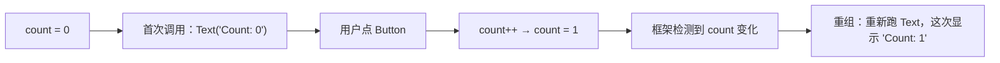

# 第 9 章：Jetpack Compose 基础

> 📖 本章你将学到：`@Composable` 怎么写、状态（`remember` / `mutableStateOf`）怎么管、重组（Recomposition）是什么、`Modifier` 怎么用，以及项目里 Composable 长什么样。
> 🔗 前置章节：[第 2 章 Kotlin 速览](02-kotlin-essentials.md)（lambda、Kotlin 语法）、[第 3 章 单 Activity](03-single-activity.md)
> 📁 项目对应目录：`ui/components/`、`ui/theme/`、所有 `*Screen.kt`

---

## 9.1 为什么需要 Compose

第 1 章埋过一颗雷："命令式 UI——`findViewById` + `setText` 状态散乱、生命周期坑"。本章就把这颗雷拆掉。

回忆一下老的 XML + Activity 写一个表单页：1 个 XML 布局 + N 个 `findViewById` + 一堆 `setText` / `setVisibility` / `notifyDataSetChanged`。业务一演进，四个坑立刻冒出来：

### 痛点 1：状态散乱——每次数据变都要手动更新

老写法里 UI 是"被命令"的：数据变了必须记得调 `textView.setText(...)`、`imageView.setImage(...)`、`recyclerView.notifyDataSetChanged()`。状态散落在 Adapter、Activity、Intent、Bundle 各处，谁也说不清"现在屏幕上显示的到底是哪一份数据"。

更糟的是漏调一处不会崩，只会显示**陈旧数据**——一种比崩溃更难查的 bug。

### 痛点 2：容易 NPE——`findViewById` 返回可空

```kotlin
val title = findViewById<TextView>(R.id.title)   // 返回 TextView?
title.text = movie.name                          // 编译过，运行时 null 就崩
```

`findViewById` 的返回值是可空的——只要布局里 id 写错、或者还没 `setContentView` 就调用，运行时立刻 `NullPointerException`。编译器帮不了你。

### 痛点 3：生命周期坑——旋转屏幕状态全丢

Activity 旋转屏幕会销毁重建。所有用 `var` 存的 UI 状态（输入框文字、开关是否打开、列表滚动位置）都丢光。要保留就得手写 `onSaveInstanceState` / `onRestoreInstanceState`，把每个状态手动塞进 Bundle 再取出来——又繁琐又容易漏。

### 痛点 4：UI 和数据耦合——测试 UI 必须把数据也跑一遍

老写法里 UI 和数据揉在 Activity 里。想测"这个状态下的 UI 长什么样"，必须真的发网络请求、真的读数据库，把整个数据链路跑一遍才能看到结果。**UI 没法脱离数据单独测试。**

### 声明式 UI 的核心思想

四个痛点的共同根因是：**"UI 长什么样"和"怎么把 UI 改成那样"被混在了同一段代码里**。Jetpack Compose 把它拆开：

> 你用 Kotlin 函数描述"当前状态下 UI 应该长什么样"，框架负责"当状态变化时怎么把 UI 更新到那个样子"。

- 你只写 `Text("Hi, $name")`——描述 UI；
- `name` 变了，框架自动重新跑这段函数——更新 UI。

不再 `findViewById`、不再 `setText`、不再 `notifyDataSetChanged`。**UI 就是状态的函数**，状态变 UI 就变。本章下面三节分别讲：Compose 长什么样（§9.2）、最小可运行示例（§9.3）、项目里真实怎么用（§9.4）。

---

## 9.2 Compose 是什么

### 9.2.1 `@Composable` 函数——描述 UI 的函数

`@Composable` 是一个 Kotlin 编译器插件注解。给函数标上它，函数就变成了"描述 UI 的函数"：

```kotlin
@Composable
fun Greeting(name: String) {          // 输入：数据/状态
  Text(text = "Hi, $name")             // 输出：UI 描述（不是直接渲染）
}
```

关键点：`@Composable` 函数**不直接渲染像素**，它只是调用其他 `@Composable` 函数（比如内置的 `Text`、`Column`、`Button`），把"UI 应该长什么样"用一棵树描述出来。真正的渲染由框架在后台完成。

> 一句话：`@Composable` 函数把数据翻译成 UI 描述，框架再根据描述画出屏幕。

### 9.2.2 `remember { }` 与 `mutableStateOf`——在 Composable 里记状态

Composable 会被反复调用（重组，见 9.2.3）。普通 `var` 每次调用都会重置，没法"记"住状态。Compose 提供两个工具：

- **`remember { ... }`**：把一个值"钉"在 Composable 的"内存槽（Slot）"里，重组时不会重新初始化。
- **`mutableStateOf(value)`**：包一层，让值变成**可观察的状态**。值变了，框架会自动重组所有读取它的 Composable。

两者通常组合用：

```kotlin
var count by remember { mutableStateOf(0) }   // 状态：count，初值 0
```

`count` 一变 → 框架自动重组所有读 `count` 的 Composable。**你不用手动通知"UI 该刷新了"**。

### 9.2.3 重组（Recomposition）——状态变 → 函数重新跑

当被 `mutableStateOf` 包裹的状态发生变化时，框架会**重新调用**所有读取这个状态的 `@Composable` 函数——这个过程叫**重组（Recomposition）**。



关键点：框架会 diff 新旧两次调用产生的 UI 描述，**只更新真正变的那部分**——比如上例只改了 `Text` 的内容，不会重建整棵树。这就是 Compose 性能的基础。

### 9.2.4 `Modifier`——链式样式表

`Modifier` 是 Compose 的"样式表"——一个链式调用对象，用来配置 UI 的外观与行为：`padding`、`clickable`、`background`、`size`、`fillMaxWidth`……

```kotlin
Text(
  text = "Click me",
  modifier = Modifier
    .padding(16.dp)                 // 外边距
    .background(Color.Yellow)       // 背景
    .clickable { /* 点击 */ }        // 点击事件
)
```

`Modifier` 链的顺序有意义——`padding` 在 `background` 前还是后，背景会盖到 padding 还是只盖内容。这是 Compose 初学者最容易踩的细节坑。

### 声明式 vs 命令式 对比

| 维度 | 命令式（XML + setText） | 声明式（Compose） |
|------|----------------------|------------------|
| 描述 UI | XML 布局文件 | `@Composable` 函数 |
| 更新 UI | 手动 `setText` / `notifyDataSetChanged` | 状态变 → 框架自动重组 |
| 状态 | 散在多个 `var` | `remember { mutableStateOf(...) }` 集中管理 |
| 样式 | XML 属性 + style 文件 | `Modifier` 链 |
| 屏幕旋转 | 状态全丢，手写 `onSaveInstanceState` | VM 持有状态，Composable 自动重组（第 10 章） |
| 测试 | 必须真跑数据 | Composable 可脱离数据单独渲染 |

> 一句话对比：命令式 UI 是"被命令的"（你告诉它怎么变），声明式 UI 是"被描述的"（你描述它该长什么样，框架负责变）。

---

## 9.3 最小示例：一个可运行的计数器

下面这段代码是一个**完整可运行**的 Composable——不依赖项目，复制到任何 Compose 工程的 `setContent { }` 里就能跑：

```kotlin
@Composable
fun CounterScreen() {
  var count by remember { mutableStateOf(0) }    // 状态：当前计数（初值 0）

  Column(
    modifier = Modifier.padding(16.dp),
    horizontalAlignment = Alignment.CenterHorizontally
  ) {
    Text(text = "Count: $count")                 // 显示状态：count 一变这里自动更新
    Button(onClick = { count++ }) {              // 点击 → 改状态 → 触发重组
      Text("Click me")
    }
  }
}
```

运行流程一句话讲清：

1. 首次进入 → 框架调用 `CounterScreen()` → `count = 0` → 渲染 `Count: 0` 和按钮。
2. 用户点按钮 → `onClick` 触发 → `count++` → `count` 变成 1。
3. 框架检测到 `count` 变化 → **重组** `CounterScreen()` → 这次 `Text(text = "Count: 1")` → 屏幕更新。

**全程没有 `setText`、没有 `findViewById`、没有 `Adapter`、没有 `notifyDataSetChanged`。** 你只描述了"UI 在 `count = N` 时应该长什么样"，剩下的框架全包了。

> 这就是声明式 UI 的核心体验：**你描述状态到 UI 的映射，框架负责把 UI 改成那个样子。**

---

## 9.4 项目中怎么用：三个真实 Composable

本节是全章重点。从简到繁看三个项目里真实存在的 Composable：最简单的按钮（学 `@Composable` 函数怎么写）、带图片的组件（学参数和 `Modifier` 怎么传）、整个 App 的主题入口（学主题也是 Composable）。

### 9.4.1 最简单的 Composable——`CollectButton`

📁 项目对应位置：`app/src/main/java/me/jbusdriver/modern/ui/components/CollectButton.kt:14`

```kotlin
@Composable
fun CollectButton(
  isCollected: Boolean,                       // ← 状态从外部传入（State Hoisting）
  onToggle: () -> Unit,                       // ← 事件回调（状态变化交给上层）
  modifier: Modifier = Modifier
) {
  IconButton(onClick = onToggle) {            // 内置 Material3 组件
    Icon(
      painter = painterResource(
        if (isCollected) R.drawable.favorite_fill_24px
        else R.drawable.favorite_24px
      ),
      contentDescription = if (isCollected) "取消收藏" else "收藏",
      tint = if (isCollected) MaterialTheme.colorScheme.error
             else MaterialTheme.colorScheme.onSurface
    )
  }
}
```

**关键点：状态提升（State Hoisting）**

注意这个 Composable **自己不持有 `isCollected` 状态**——它由调用方传入；点击事件也通过 `onToggle` 回调交给调用方处理。这种"无状态 Composable"叫 **Stateless Composable**，是 Compose 最推荐的模式。

为什么要提升？因为状态集中到上层（理想是 ViewModel，第 10 章细讲）后：

- 同一个 Composable 可以复用——收藏按钮、点赞按钮、关注按钮都可以用同一套代码改改图标；
- Composable 变成纯函数——同样的输入永远产生同样的 UI，方便测试；
- 状态变化和 UI 渲染解耦——VM 改一个 `isCollected` 字段，所有用了它的 Composable 自动更新。

> Compose 的核心模式：**Composable 尽量无状态，状态集中在 ViewModel**。

### 9.4.2 带图片的 Composable——`AppAsyncImage`

📁 项目对应位置：`app/src/main/java/me/jbusdriver/modern/ui/components/AppAsyncImage.kt:64`

```kotlin
@Composable
fun AppAsyncImage(
  model: Any?,                                // Coil 加载模型（URL / Uri / File）
  contentDescription: String?,                // 无障碍描述
  modifier: Modifier = Modifier,              // ← 约定：modifier 作为最后一个默认参数
  contentScale: ContentScale = ContentScale.Crop,
  dim: Boolean = true                         // 是否在夜间模式压暗
) {
  val colorFilter = dimColorFilter()          // 读取应用当前主题，夜间模式返回压暗滤镜
  AsyncImage(                                 // Coil 提供的 Composable
    model = model,
    contentDescription = contentDescription,
    modifier = modifier,
    contentScale = contentScale,
    colorFilter = colorFilter
  )
}

@Composable
fun dimColorFilter(enabled: Boolean = LocalIsDarkTheme.current): ColorFilter? =
  remember(enabled) { if (enabled) ColorFilter.colorMatrix(DarkDimMatrix) else null }
```

**三个关键点：**

1. **`Modifier` 作为最后一个默认参数**——这是 Compose 的通用约定。所有 Composable 都把 `modifier: Modifier = Modifier` 放在最后（或倒数），方便调用方从外部定制布局（padding、size、clickable 都能往 `modifier` 里塞）。
2. **`CompositionLocal`——`LocalIsDarkTheme.current`** 是项目自定义的"环境变量"（见 9.4.3）。主题状态从树顶（`JBusTheme`）"注入"，中间 Composable 不用一层层透传参数——任何深度的 Composable 都能直接 `LocalIsDarkTheme.current` 读到当前是否夜间模式。
3. **包装第三方组件**——`AppAsyncImage` 包装 Coil 的 `AsyncImage`，加上项目特有的"夜间压暗"逻辑。全站所有图片都走它，保证夜间模式行为统一。

### 9.4.3 主题入口——`JBusTheme`

📁 项目对应位置：`app/src/main/java/me/jbusdriver/modern/ui/theme/Theme.kt:112`

```kotlin
@Composable
fun JBusTheme(content: @Composable () -> Unit) {
  val theme = hiltViewModel<ThemeViewModel>()                       // Hilt 注入 ThemeViewModel
  val themeMode by theme.themeMode.collectAsStateWithLifecycle()    // 当前主题模式
  val dynamicColor by theme.dynamicColor.collectAsStateWithLifecycle()

  val darkTheme = when (themeMode) {
    ThemeMode.DARK -> true
    ThemeMode.LIGHT -> false
    ThemeMode.SYSTEM -> isSystemInDarkTheme()                      // 跟随系统
  }

  val colorScheme = when {
    dynamicColor && Build.VERSION.SDK_INT >= Build.VERSION_CODES.S ->
      if (darkTheme) dynamicDarkColorScheme(LocalContext.current)
      else dynamicLightColorScheme(LocalContext.current)            // Android 12+ 动态取色
    darkTheme -> DarkColorScheme
    else -> LightColorScheme
  }

  // 用 SideEffect 把状态栏图标颜色同步到系统（每次重组后跑一次）
  SideEffect {
    val window = (LocalView.current.context as Activity).window
    val controller = WindowCompat.getInsetsController(window, LocalView.current)
    controller.isAppearanceLightStatusBars = !darkTheme
    controller.isAppearanceLightNavigationBars = !darkTheme
  }

  CompositionLocalProvider(LocalIsDarkTheme provides darkTheme) {
    MaterialTheme(colorScheme = colorScheme, typography = Typography) {
      content()                              // ← 子 Composable 在这里渲染
    }
  }
}
```

**三个关键点：**

1. **主题也是 Composable**——`JBusTheme { ... }` 包裹整棵 UI 树（在 `ModernMainActivity.onCreate` 的 `setContent { JBusTheme { JBusNavigation() } }` 里调用，第 3 章见过）。Compose 里"一切皆 Composable"——主题、布局、组件、动画都是。
2. **主题状态又是状态提升**——`themeMode` 从 `ThemeViewModel` 来（Hilt 注入），`JBusTheme` 自己不持有主题状态，只读取并应用。和 9.4.1 的 `CollectButton` 是同一种模式：状态在上层，Composable 只渲染。
3. **`CompositionLocalProvider` 提供"环境变量"**——`LocalIsDarkTheme provides darkTheme` 把"当前是否夜间"塞进环境，子树任何深度的 Composable（如 9.4.2 的 `dimColorFilter`）都能用 `LocalIsDarkTheme.current` 读到，不用一层层透传。

> `MaterialTheme` 是 Material3 设计系统的入口——它提供颜色（`colorScheme`）、字体（`typography`）、形状三套契约，子 Composable 用 `MaterialTheme.colorScheme.primary` 之类就能拿到当前主题色。这就是为什么 9.4.1 的 `CollectButton` 能直接写 `MaterialTheme.colorScheme.error`。

📁 项目对应位置：项目所有 Composable 都在 `ui/components/`（通用组件）和各功能屏目录（`ui/movielist/`、`ui/detail/`、`ui/forum/` 等）的 `*Screen.kt` 里。主题在 `ui/theme/`（`Theme.kt`、`Type.kt`、`Color.kt`）。

---

## 9.5 常见误区与调试技巧

Compose 上手容易，但有五个坑新人几乎必踩。前四个是写法问题，第五个是心智模型问题。这几条同时也是项目 `AGENTS.md` 里明确要求的代码规则。

### 误区 1：`remember` 和 `rememberSaveable` 用反

**症状**：Composable 里用 `remember { mutableStateOf("") }` 存了输入框文字，旋转屏幕后输入框空了。

**原因**：`remember` 只在**重组间**保留状态，Activity 重建（旋转屏幕、进程被杀恢复）时状态会丢。

**怎么修**：用 `rememberSaveable`——它会自动把状态序列化进 Bundle，跨配置变化保留：

```kotlin
// ❌ 旋转屏幕会丢
var text by remember { mutableStateOf("") }

// ✅ 旋转屏幕保留（要求类型能放进 Bundle：String/Int/Boolean 等基本类型）
var text by rememberSaveable { mutableStateOf("") }
```

简单类型（String、Int、Boolean、Parcelable）直接用；自定义对象需要写 `Saver`。**只有 ViewModel 持有的状态才不需要 `rememberSaveable`**——VM 本身就跨配置变化存活（第 10 章）。

### 误区 2：在 `@Composable` 里写副作用

**症状**：在 Composable 里直接发网络请求、读数据库、弹 Toast，结果请求发了好几次、数据库读了好几遍、Toast 闪个不停。

**原因**：Composable 会被**反复重组**（状态变、动画、列表滚动都可能触发）。直接在函数体里写副作用，每次重组都会重新执行一次。

**怎么修**：用副作用 API 把副作用包起来：

```kotlin
@Composable
fun MyScreen(viewModel: MyViewModel = hiltViewModel()) {
  // ❌ 错：每次重组都发请求
  // viewModel.load()

  // ✅ 对：LaunchedEffect 只在首次进入（或 key 变化时）跑一次
  LaunchedEffect(Unit) {
    viewModel.load()
  }
}
```

| API | 触发时机 | 典型用途 |
|-----|---------|---------|
| `LaunchedEffect(key) { }` | 首次进入 / `key` 变化时 | 发请求、订阅 Flow |
| `SideEffect { }` | 每次重组后 | 同步状态到非 Compose 对象（如状态栏） |
| `DisposableEffect { }` | 进入 + 离开（带清理） | 注册/反注册监听器 |

**红线**：`@Composable` 函数体里**永远不能直接写副作用**——网络、IO、Toast、Navigation 跳转都得走副作用 API。

### 误区 3：列表忘了写 `key`

**症状**：`LazyColumn` 滚动后，列表项里的开关状态"串错"——第 3 项的开关跑到第 5 项了。

**原因**：`LazyColumn` 为了性能会**复用** Composable 实例。如果不告诉它"每一项的唯一身份"，它就按位置复用——位置变了，里面 `remember` 的状态就跟着跑到新位置。

**怎么修**：给每项一个稳定的 `key`：

```kotlin
LazyColumn {
  items(items = movieList, key = { it.id }) { movie ->   // ← key 用业务 ID
    MovieItem(movie = movie, onClick = { ... })
  }
}
```

`key` 必须是**稳定且唯一**的（用业务 ID，不要用 `it.hashCode()` 或 list index）。这是项目 `AGENTS.md` 明确要求的规则。

### 误区 4：状态读取用 `=`，应该用 `by`

**症状**：写了 `val state = remember { mutableStateOf(0) }`，状态变了 UI 不刷新。

**原因**：`=` 写法拿到的是 `MutableState<Int>` 包装对象，读值要 `state.value`，写值也要 `state.value = ...`。如果误用 `state + 1`（漏了 `.value`），编译过但读的不是当前值。

**怎么修**：用 `by` 委托语法，像普通变量一样读写：

```kotlin
// ❌ 别这样：读写都得 .value，容易漏
val state = remember { mutableStateOf(0) }
state.value = state.value + 1

// ✅ 推荐：by 委托，像普通变量
var count by remember { mutableStateOf(0) }
count++                                     // 直接读写
```

`by` 委托背后是 Kotlin 属性委托机制——读写 `count` 会自动转发到 `mutableStateOf` 的 getter/setter，从而触发重组。

### 误区 5：以为 Composable 按顺序调用、调用次数确定

**症状**：在 Composable 里写 `if (x) doSomething()`，期望"只跑一次"，结果跑了好几次或一次没跑。

**原因**：**Composable 的调用顺序和次数不保证**。框架可能为了性能跳过重组某些子树、也可能重组多次。任何依赖"我这次是第几次被调用""我前后被谁调用"的代码都是错的。

**心智模型**：

> `@Composable` 函数必须是**纯函数**——同样的输入（参数 + 读取的状态）必须产生同样的 UI 描述。不能有副作用、不能依赖调用顺序、不能读全局变量、不能假设重组次数。

如果需要"只跑一次"的逻辑，用 `LaunchedEffect(Unit) { ... }`（误区 2）；需要"每次重组都跑"的副作用，用 `SideEffect { ... }`。函数体本身应该纯粹描述 UI。

> 小技巧：怀疑代码有副作用问题时，开 Android Studio 的 **Layout Inspector → Recomposition Counts**，能看到每个 Composable 被重组了多少次——异常频繁重组通常是状态读取写在错的地方。

---

## 9.6 小结与下一站

本章从"老 Android 命令式 UI 的四大痛点"出发，把 Jetpack Compose 走了一遍：

- **核心思想**：声明式 UI——你描述"状态到 UI 的映射"，框架负责"状态变时怎么把 UI 改成那样"。
- **四件套**：`@Composable`（描述 UI）、`remember { mutableStateOf() }`（记忆状态）、重组（状态变自动重新跑）、`Modifier`（链式样式）。
- **项目落地**：`CollectButton`（State Hoisting——无状态 Composable）、`AppAsyncImage`（`Modifier` 约定 + `CompositionLocal` + 包装第三方组件）、`JBusTheme`（主题也是 Composable + 状态从 VM 来）。
- **五大坑**：`remember` vs `rememberSaveable`、别在 Composable 里写副作用（用 `LaunchedEffect`）、列表别忘了 `key`、状态用 `by` 委托、Composable 必须是纯函数。

读完本章，你应该能看懂项目里所有 `@Composable` 函数的结构，并知道新增一个组件时该往 `ui/components/` 加文件。

但还有一个问题没回答：**状态既然要"提升"，提升到哪？** 9.4.1 提到"理想是 ViewModel”，9.4.3 的 `JBusTheme` 也从 `ThemeViewModel` 拿状态。ViewModel 到底是个什么东西、为什么 Composable 应该从它读状态、状态怎么从 VM 流到 Composable？

```
下一站：第 10 章 ViewModel + StateFlow —— 既然状态要"提升"，提升到哪？就是 ViewModel。
```

---

🔍 深入阅读：
- Compose 官方文档：https://developer.android.com/develop/ui/compose
- Compose 状态文档：https://developer.android.com/develop/ui/compose/state
- Compose 副作用 API：https://developer.android.com/develop/ui/compose/effects
- 项目所有 Composable：`ui/components/`、各功能屏的 `*Screen.kt`
- 项目主题：`ui/theme/Theme.kt`、`ui/theme/Type.kt`、`ui/theme/Color.kt`
