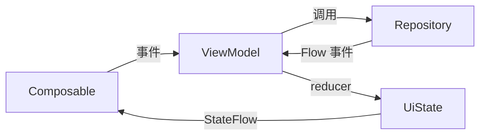

# 第 10 章：ViewModel + StateFlow —— MVVM 在 Compose 时代怎么写

> 📖 本章你将学到：MVVM 在 Compose 时代怎么写、ViewModel 怎么用 StateFlow 暴露状态、项目里的 StateReducer 模式怎么把"老状态+事件→新状态"做成纯函数、ViewModel 不能做什么。
> 🔗 前置章节：[第 5 章 协程与 Flow](05-coroutines-flow.md)（StateFlow）、[第 9 章 Compose 基础](09-compose-basics.md)（状态提升）
> 📁 项目对应目录：所有 `*ViewModel.kt`、`*StateReducers.kt`、`*UiState` 数据类

---

## 10.1 为什么需要 ViewModel

第 9 章留了个尾巴："状态应该往上提升，理想是 ViewModel"。第 5 章也埋了伏笔："`StateFlow` 是 UI 状态容器"。本章就把这两条线收拢，讲清楚 ViewModel 是什么、怎么和 StateFlow 配合、项目里完整的 MVVM 模式长什么样。

先看没有 ViewModel 会怎样。三个痛点：

### 痛点 1：UI 写在 Activity 里——旋转屏幕状态全丢

老 Android 写一个登录页：用户名、密码、加载中弹窗、错误提示，全都用 `var` 存在 Activity 字段里。Activity 旋转屏幕会销毁重建——所有 `var` 重置为初值，用户输了一半的密码瞬间消失。

拯救方案？要么手写 `onSaveInstanceState` 把每个状态塞进 Bundle 再取出来（又繁琐又容易漏字段），要么上更古早的 `Loader`（API 早就该废弃）。一旦业务再加个"分页列表的当前页码""滚动位置""筛选条件"，状态序列化的工作量立刻失控。

### 痛点 2：数据逻辑写在 Composable 里——一坨耦合

就算第 9 章教会了你用 Compose，新手很容易写出这种 Composable：

```kotlin
// ❌ 反面教材：Composable 里调 Repo、处理错误、转换数据，UI 和业务耦合
@Composable
fun MovieScreen() {
  var movies by remember { mutableStateOf<List<Movie>>(emptyList()) }
  var isLoading by remember { mutableStateOf(true) }
  var error by remember { mutableStateOf<String?>(null) }

  LaunchedEffect(Unit) {
    try {
      isLoading = true
      movies = repo.loadPage(1)            // ← UI 直接调 Repository
      error = null
    } catch (e: Exception) {
      error = e.message                    // ← 错误处理写在 UI 里
    } finally {
      isLoading = false
    }
  }
  // ... 渲染 UI
}
```

问题是：业务一演进（加分页、加缓存、加错误重试、加单元测试），这个 Composable 会越来越长。**UI 和数据逻辑揉在一起，没法单独测试 UI，也没法单独测试业务逻辑**。

### 痛点 3：状态散乱——谁也说不清"当前 UI 是怎么算出来的"

老项目里经常见到一种状态大杂烩：几个 `var`、几个 `LiveData`、几个回调混着用，改一个状态要在三处同步更新。一旦漏掉一处同步，UI 就显示**陈旧数据**——比崩溃更难查的 bug。

> Android 现代做法是把"UI 状态"和"业务逻辑"抽到一个叫 **ViewModel** 的类里：ViewModel 持有状态、调 Repository、把状态通过 **StateFlow** 暴露给 Composable。这就是 Compose 时代的 MVVM。本章下面三节分别讲：MVVM 是什么（§10.2）、最小示例（§10.3）、项目里怎么用（§10.4）。

---

## 10.2 MVVM 在 Compose 时代是什么

三个名词串起来：ViewModel、StateFlow、UiState 数据类。

### 1. ViewModel 是什么

**一个跨越配置变化、生命周期感知的类**。Android 框架保证：旋转屏幕时 Activity 销毁重建，但 ViewModel **不销毁**——新 Activity 自动拿到同一个 VM 实例。这样所有 UI 状态都保留下来，不用 `onSaveInstanceState`。

它原本是为 XML 时代的 `LiveData` 设计的，但和 Compose 搭得也很好——VM 持有状态、暴露状态流，Composable 订阅状态流。

### 2. StateFlow 是 UI 状态的最佳容器

第 5 章讲过 `StateFlow` 的两个特点：**热流**（永远有当前值）、**状态绑定**（新订阅者立刻拿到当前值）。这两点正好匹配 UI 的需求——"屏幕上当前应该显示什么"。

Composable 里只要写 `vm.uiState.collectAsStateWithLifecycle()`，就能把 StateFlow 转成 Compose 状态：状态一变，Composable 自动重组（第 9 章讲过）。`WithLifecycle` 后缀让收集自动跟随生命周期——`ON_STOP` 时暂停（省电），`ON_START` 时恢复。

### 3. 单一 UiState 数据类

把所有 UI 需要的状态打包成一个 `data class`——loading、data、error、分页、滚动状态……全在一个对象里。ViewModel 暴露一个 `StateFlow<UiState>`，Composable 只 collect 它。

这种"状态从 VM 单向流到 UI、事件从 UI 单向发到 VM"的写法叫**单向数据流（Unidirectional Data Flow, UDF）**。UDF 是 Compose 官方推荐的架构：



读图关键：

- **UI 不直接调 Repo**——它只发"事件"给 VM（调 VM 的方法，如 `vm.refresh()`）。
- **VM 收到事件后调 Repo**，Repo 返回数据（第 5 章的 `Flow<CachedLoadEvent>`）。
- **VM 用 reducer 把"老状态 + 事件"算成"新状态"**，写入 `StateFlow`。
- **StateFlow 自动通知 UI 重组**——UI 自动刷新。

UDF 的好处：状态变化**只走一条路**（VM → StateFlow → UI），来源可追溯；UI 永远是状态的纯映射，无副作用。

---

## 10.3 最小示例：一段 Counter 学完 MVVM

下面这段代码是一个**完整可运行**的最小 MVVM——不依赖项目，复制到任何 Compose + Hilt 工程就能跑。注意四个角色：UiState 数据类、ViewModel、StateFlow、Composable。

```kotlin
// 1️⃣ 单一状态对象：所有 UI 需要的状态打包成一个 data class
data class CounterUiState(
  val count: Int = 0,
  val isLoading: Boolean = false
)

// 2️⃣ ViewModel：持有状态、暴露只读流、提供事件方法
@HiltViewModel
class CounterViewModel @Inject constructor() : ViewModel() {
  // 私有可变 —— 只有 VM 自己能改
  private val _uiState = MutableStateFlow(CounterUiState())
  // 公开只读 —— UI 只能 collect 不能改
  val uiState: StateFlow<CounterUiState> = _uiState.asStateFlow()

  // 3️⃣ 事件方法：UI 想改状态就调这个
  fun increment() {
    _uiState.update { it.copy(count = it.count + 1) }    // ← reducer：老状态 → 新状态
  }
}

// 4️⃣ Composable：从 VM 读状态、把事件转发给 VM
@Composable
fun CounterScreen(vm: CounterViewModel = hiltViewModel()) {
  val state by vm.uiState.collectAsStateWithLifecycle()   // ← 状态：从 VM 来
  Button(onClick = vm::increment) {                      // ← 事件：转发给 VM
    Text("Count: ${state.count}")
  }
}
```

四个角色各自只干一件事：

| 角色 | 干什么 | 谁负责 |
|------|--------|--------|
| `CounterUiState` | 描述"屏幕上应该显示什么" | data class，纯数据 |
| `CounterViewModel` | 持有状态、调 Repo、把事件转成新状态 | VM |
| `StateFlow<UiState>` | 把状态从 VM 单向流到 UI | `asStateFlow()` 暴露 |
| `CounterScreen` | 把状态渲染成 UI、把用户操作转发给 VM | Composable |

关键点：**UI 不持有状态，全从 `vm.uiState` 来；UI 想改状态就调 `vm.increment()`；状态怎么变由 VM 决定**。这就是 UDF——单向、可追溯、可测试（VM 可以脱离 UI 单测）。

`_uiState.update { it.copy(...) }` 是固定模式：`update` 是原子操作（线程安全），lambda 里就是"reducer"——输入老状态 `it`、返回新状态。下一节看项目里 reducer 怎么抽成独立文件。

---

## 10.4 项目中怎么用：MovieListViewModel 深入

本节是全章重点。项目里每个列表屏（影片、演员、论坛板块、论坛帖子、收藏）都用同一套 MVVM 模式。以最典型的 `MovieListViewModel` 为例，从四个角度拆解：主结构、UiState 数据类、主流程方法、StateReducer 模式。

### 10.4.1 ViewModel 主结构

📁 项目对应位置：`app/src/main/java/me/jbusdriver/modern/ui/movielist/MovieListViewModel.kt:160`

```kotlin
@HiltViewModel
class MovieListViewModel @Inject constructor(
  private val repository: MovieRepository,              // ← 第 4 章注入的 Repository
  private val localVideoRepository: LocalVideoRepository
) : ViewModel() {

  // 私有可变 —— 只有 VM 自己能 update
  private val _uiState = MutableStateFlow(MovieListUiState())
  // 公开只读 —— UI 只能 collect
  val uiState: StateFlow<MovieListUiState> = _uiState.asStateFlow()

  // 派生状态：把 Room 的 Flow 转成 StateFlow（第 5 章讲过 stateIn）
  val downloadedCodes: StateFlow<Set<String>> =
    localVideoRepository.observeDownloadedCodes()
      .stateIn(viewModelScope, SharingStarted.WhileSubscribed(5_000), emptySet())

  // 主流程方法（10.4.3 展开）
  fun loadFirstPage() { ... }
  fun revalidate() { ... }
  fun refresh() { ... }
  fun loadMore() { ... }
}
```

两个关键点：

**关键点 1：`_uiState` 私有 + `uiState` 公开**。这是项目的铁则——**ViewModel 不能把 `MutableStateFlow` 直接暴露给 UI**。否则 UI 就能反向写状态，绕过 reducer，状态来源就乱了。`asStateFlow()` 把可变流变成只读流，**编译器层面就堵住了"UI 改状态"的可能**——这是比靠纪律更强的保障。

**关键点 2：派生状态用 `stateIn`**。`downloadedCodes` 是从 Room 来的"哪些影片已下载"集合，UI 需要它来显示角标。它不是 UI 主状态，但是 UI 需要的派生数据——用 `stateIn` 把冷流转热流，单独暴露一个 `StateFlow`。第 5 章详细讲过 `WhileSubscribed(5_000)` 的含义。

### 10.4.2 UiState 是个数据类

📁 项目对应位置：`app/src/main/java/me/jbusdriver/modern/ui/movielist/MovieListViewModel.kt:113`

```kotlin
data class MovieListUiState(
  val movies: List<MovieUiModel> = emptyList(),       // ← 当前已加载的列表
  val pageInfo: PageInfo = PageInfo(),                // ← 分页信息（当前页/下一页）
  val isLoading: Boolean = false,                     // ← 首次加载中
  val isRefreshing: Boolean = false,                  // ← 下拉刷新中
  val isLoadingMore: Boolean = false,                 // ← 加载更多（翻页）中
  val error: Int? = null,                             // ← 错误信息（资源 ID）
  val hasMore: Boolean = true,                        // ← 还有更多数据可加载
  val isRevalidating: Boolean = false,                // ← 后台刷新中
  val pendingFreshResult: MoviePageResult? = null,    // ← 后台刷新的新数据，等用户决定是否应用
  val refreshMessage: Int? = null,                    // ← 轻量 Snackbar 消息
  // ... 还有 showAll、filterInfo 等
)
```

**所有 UI 需要的状态打包成一个对象**——这样 Composable 只 collect 一个 `uiState`，不用担心漏订阅某个状态。新增 UI 字段时，加一个属性 + 在 reducer 里赋值，整个 UI 自动看到新字段。

注意所有字段都有默认值——VM 构造时 `MutableStateFlow(MovieListUiState())` 拿到的是一个"空状态"，UI 立刻能渲染（空列表 + 不加载中），不会 NPE。

### 10.4.3 主流程——loadFirstPage / revalidate / refresh / loadMore

📁 项目对应位置：`app/src/main/java/me/jbusdriver/modern/ui/movielist/MovieListViewModel.kt:167`

VM 暴露给 UI 的事件方法有四个，分别对应不同用户场景。看 `loadFirstPage` 的结构：

```kotlin
fun loadFirstPage() {
  if (_uiState.value.isLoading) return                // ← 防重入
  pages.startFirstPage()
  firstPageJob?.cancel()                              // ← 取消上一次请求
  val identity = currentListIdentity()
  val generation = beginListRequest(identity)         // ← 请求版本号，防竞态
  firstPageJob = viewModelScope.launch {
    _uiState.update { it.copy(isLoading = true, error = null) }   // ← 标记加载中
    val flow = pageSource.observeFirstPage(...)       // ← 拿到 Flow<CachedLoadEvent>
    flow.collect { event ->
      if (!isCurrent(generation, identity)) return@collect        // ← 旧请求忽略
      when (event) {
        is CachedLoadEvent.Cached -> _uiState.update { it.applyFirstPageCached(event.entry) }
        is CachedLoadEvent.Fresh  -> _uiState.value = _uiState.value.applyFirstPageFresh(event.entry)
        is CachedLoadEvent.Failure -> _uiState.update { it.applyFirstPageFailure(event, hasContent) }
      }
    }
  }
}
```

`when` 三个分支就是第 5 章讲的 SWR 三态（缓存 / 新数据 / 失败），每个分支调一个 reducer（10.4.4 展开）。四个方法各自职责：

| 方法 | 触发场景 | 行为 |
|------|---------|------|
| `loadFirstPage` | 第一次进页面、切 Tab | 订阅第 1 页 SWR 流，缓存先显示、新数据直接覆盖（列表刚初始化无跳位问题） |
| `revalidate` | 切回 Tab、后台返回 | 后台拉新数据，**不直接覆盖**——用户滚到第 3 页时突然替换会让位置错乱，所以走 pending + Snackbar 提示 |
| `refresh` | 用户下拉刷新 | 强制忽略缓存、清空重载第 1 页 |
| `loadMore` | 滚到底部 | 加载下一页，追加到列表末尾（不是覆盖） |

为什么四个方法要分开？因为它们对 UI 的**副作用粒度不同**——`loadFirstPage` 是"列表刚初始化，直接覆盖"；`revalidate` 是"用户在看，不能打断"；`refresh` 是"用户主动要求刷新"；`loadMore` 是"追加不是覆盖"。这些差异写在 VM 里，UI 只需要调对应的方法。

### 10.4.4 StateReducer 模式——状态转换抽成纯函数

📁 项目对应位置：`app/src/main/java/me/jbusdriver/modern/ui/movielist/MovieListStateReducers.kt:1`

注意 `loadFirstPage` 里那几行：

```kotlin
_uiState.update { it.applyFirstPageCached(event.entry) }
```

`applyFirstPageCached` 不是 VM 的方法，而是定义在**另一个文件** `MovieListStateReducers.kt` 里的扩展函数：

```kotlin
// 在 MovieListStateReducers.kt 里——独立文件，纯函数
internal fun MovieListUiState.applyFirstPageCached(
  entry: CacheEntry<MoviePageResult>
): MovieListUiState =
  copy(
    movies = entry.value.movies.map { m -> m.toUiModel() },
    pageInfo = entry.value.pageInfo,
    isLoading = false,
    isRevalidating = entry.isExpired,           // ← 缓存过期则继续转圈等新数据
    lastUpdatedAtMillis = entry.storedAtMillis,
    error = if (entry.value.movies.isEmpty()) R.string.no_data else null
  )

internal fun MovieListUiState.applyFirstPageFresh(
  entry: CacheEntry<MoviePageResult>
): MovieListUiState =
  copy(
    movies = entry.value.movies.map { m -> m.toUiModel() },
    pageInfo = entry.value.pageInfo,
    isLoading = false,
    isRevalidating = false,
    pendingFreshResult = null,
    // ...
  )

internal fun MovieListUiState.applyFirstPageFailure(
  event: CachedLoadEvent.Failure,
  hasContent: Boolean
): MovieListUiState =
  if (event.hadCachedValue || hasContent) {
    copy(isLoading = false, isRevalidating = false)         // ← 有缓存就静默忽略错误
  } else {
    copy(isLoading = false, isRevalidating = false, error = R.string.load_failed)
  }
```

这就是**StateReducer 模式**——把"老状态 + 事件 → 新状态"的转换抽成纯函数。三个关键点：

1. **reducer 是纯函数**：输入老状态（`this`）+ 事件参数，输出新状态（`copy(...)`），**无副作用**。不在 reducer 里发请求、不发事件、不调 Repo——只算新状态。
2. **reducer 抽到独立文件**：`*StateReducers.kt` 和 `*ViewModel.kt` 配对存在。这让 VM 主体保持瘦（只管"调 Repo + 调 reducer"），reducer 集中管理"状态怎么变"。
3. **每个列表屏都有配对的 reducer 文件**：`MovieListStateReducers.kt`、`ActressListStateReducers.kt`、`GenreListStateReducers.kt`、`LinkMovieListStateReducers.kt`、`ForumBoardsStateReducers.kt`、`ForumThreadListStateReducers.kt`、`ForumThreadDetailStateReducers.kt`。

reducer 拆出来后，VM 主体就极简——`flow.collect { event -> _uiState.update { it.applyXxx(event) } }` 一行就够。状态怎么变的细节全在 reducer 文件里，方便阅读和测试。

📁 项目对应位置：每个 `*ViewModel.kt` 都有同名 `*StateReducers.kt` 配对（`ui/movielist/`、`ui/forum/` 下都有）

---

## 10.5 常见误区与调试技巧

这五条全部对应 `AGENTS.md` 里的明确规则，是项目的硬约束。踩了任何一条都会被 code review 打回。

### 误区 1：ViewModel 不能暴露 callback 给 UI

**症状**：看到老教程里 ViewModel 写 `fun setOnDataLoadedListener(cb: (List<Movie>) -> Unit)`，想照样写。

**为什么不能**：callback 把"状态"和"事件"混在 UI 层——UI 既要 collect 状态又要注册回调，状态来源就乱了。而且 callback 不跟随生命周期，旋转屏幕重建后旧 callback 还挂着，新数据回来时回调到一个已经销毁的 UI。

**正确做法**：状态用 `StateFlow`，一次性事件（Toast、Snackbar、导航跳转）用 `SharedFlow`。`AGENTS.md` 写得明白——"ViewModels must not expose callbacks to the UI; expose state and one-shot events as Flow/StateFlow/SharedFlow instead"。

### 误区 2：不要在 VM 里持有 `Context` / `View` / `Activity`

**症状**：VM 里需要弹 Toast、需要拿资源字符串、需要 `Intent`，于是注入了 `Activity` 或 `View`——旋转屏幕后内存泄漏，LeakCanary 报错。

**为什么不能**：VM 生命周期比 Activity **长**——旋转屏幕时 Activity 销毁重建，但 VM 留下。如果 VM 持有 Activity 引用，旧 Activity 无法被 GC，**经典的内存泄漏**。第 4 章详细讲过这条红线。

**正确做法**：

- 需要 Context 用 `@ApplicationContext`（App 级别，安全）。
- 需要弹 Toast——发一个 `SharedFlow<UserMessage>`，UI 收到后弹。
- 需要资源字符串——发资源 ID（`Int`）给 UI，UI 用 `stringResource(id)` 解析。

### 误区 3：`StateFlow` 用 `asStateFlow()` 暴露给 UI

**症状**：写了 `val uiState = MutableStateFlow(...)` 直接公开（没有 `private` + `asStateFlow()` 那一对），结果 UI 里有人偷偷 `vm.uiState.value = ...` 直接改状态，状态来源不可追溯。

**正确做法**：铁则——

```kotlin
private val _uiState = MutableStateFlow(MyUiState())          // ← 私有可变
val uiState: StateFlow<MyUiState> = _uiState.asStateFlow()     // ← 公开只读
```

`asStateFlow()` 把 `MutableStateFlow` 转成只读的 `StateFlow` 接口——外部调 `.value = ...` 编译就报错。**编译器层面堵死绕过 reducer 改状态的可能**。

### 误区 4：事件用 `SharedFlow`，状态用 `StateFlow`

**症状**：把 Toast 消息塞进 `StateFlow<String>`，结果旋转屏幕后 Toast 又弹了一次；或者把列表数据塞进 `SharedFlow<List<Movie>>`，结果新订阅者拿不到当前值，屏幕空白。

**为什么**：两种流的语义不同——

| 流类型 | 有"当前值" | 适合 |
|--------|----------|------|
| `StateFlow<T>` | 有 | **状态**（loading、data、error）——重连时 UI 要立即拿到当前值 |
| `SharedFlow<T>` | 无 | **事件**（Toast、导航）——事件不能"重放"，按 back 回到上一页不应该重新弹一次 Toast |

**正确做法**：项目里 `error: Int?` 这种状态字段放在 `UiState` 里走 `StateFlow`；轻量 Snackbar 消息用 `refreshMessage: Int?`（也是 StateFlow 字段，消费后置 null 模拟"一次性"）；纯一次性事件（如导航跳转命令）才用独立的 `SharedFlow`。

### 误区 5：reducer 要纯函数，别在 reducer 里发请求

**症状**：在 reducer 扩展函数里写了 `viewModelScope.launch { repo.refresh() }`——reducer 看起来干净了，但副作用藏在里面，测试 reducer 时会真发请求。

**为什么不能**：reducer 的价值就是**可测试、可预测**——给定老状态 + 事件，输出新状态。一旦混入副作用，reducer 就不可测了（测试它要 Mock Repo）。

**正确做法**：reducer 只算新状态、返回新状态；副作用（调 Repo、发事件、记日志）放在 VM 主流程方法里（`loadFirstPage` / `refresh` 这种）。看 10.4.3 的代码——`viewModelScope.launch { ... }` 在 VM 方法里，reducer 只是 `update { it.applyXxx(event) }` 里的纯转换。

> 小技巧：怀疑 reducer 有副作用时，把它单独拷到一个不依赖 Android 框架的测试里跑——如果跑通（不需要 Mock Repo、不需要 viewModelScope），说明它是纯的。

---

## 10.6 小结与下一站

本章把第 5 章（StateFlow）和第 9 章（状态提升）收拢，讲清楚 Compose 时代的 MVVM 模式：

- **MVVM 三件套**：ViewModel（跨配置变化持有状态）+ StateFlow（状态容器）+ UiState 数据类（打包所有 UI 状态）。
- **单向数据流（UDF）**：UI 发事件给 VM → VM 调 Repo → VM 用 reducer 算新状态 → StateFlow 通知 UI 重组。状态变化只走一条路，可追溯。
- **StateReducer 模式**：把"老状态 + 事件 → 新状态"抽成纯函数，放到独立的 `*StateReducers.kt` 文件，VM 主体保持瘦。项目每个列表屏都有配对的 reducer 文件。
- **红线**：VM 不暴露 callback（用 StateFlow / SharedFlow）、不持有 Activity（用 `@ApplicationContext`）、`MutableStateFlow` 私有 + `asStateFlow()` 公开、事件用 `SharedFlow` 状态用 `StateFlow`、reducer 要纯。

读完本章，你应该能看懂项目里所有 `*ViewModel.kt` + `*StateReducers.kt` 配对，并且知道新增一个列表屏时该建哪些文件：一个 `UiState` 数据类、一个 `ViewModel`（持 `_uiState`/`uiState`）、一个 `StateReducers.kt`、一个 `Screen`（`collectAsStateWithLifecycle`）。

```
下一站：第 11 章 Navigation 3 与路由 —— 多个 Screen/ViewModel 之间怎么跳转？路由参数（如 movieUrl、tid）怎么传给 VM？@AssistedInject 又是怎么和导航配合的？
```

---

🔍 深入阅读：
- ViewModel 官方文档：https://developer.android.com/topic/libraries/architecture/viewmodel
- Compose 状态文档：https://developer.android.com/develop/ui/compose/state
- Compose 中的 StateFlow 与 collectAsStateWithLifecycle：https://developer.android.com/kotlin/flow/stateflow-and-sharedflow
- 项目所有 ViewModel：`ui/<feature>/` 目录下所有 `*ViewModel.kt`（`ui/movielist/`、`ui/forum/`、`ui/detail/` 等）
- AGENTS.md 里的 ViewModel 规则（"ViewModels must not expose callbacks to the UI"）
